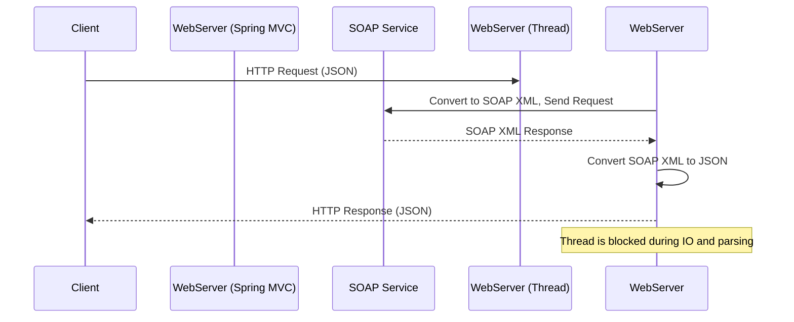
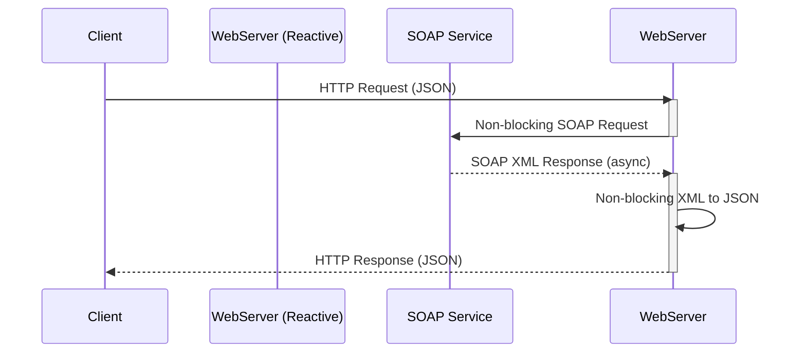
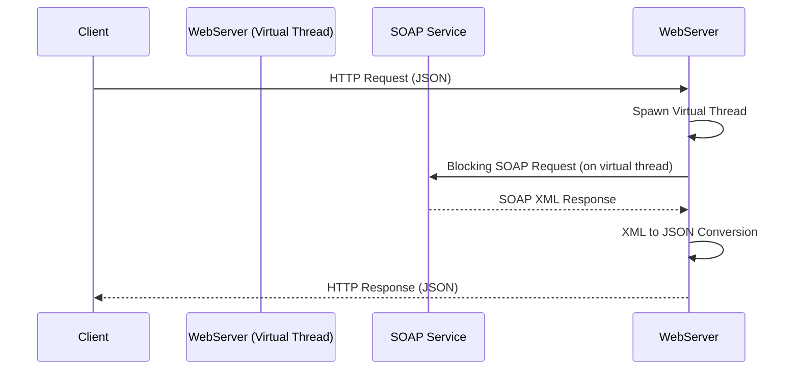
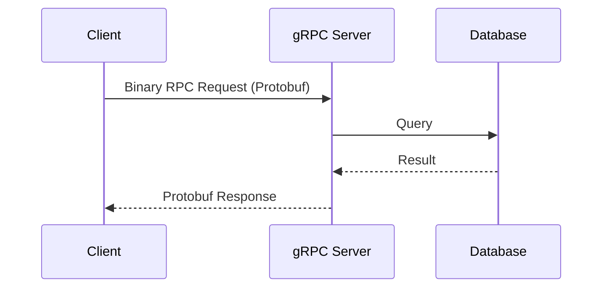
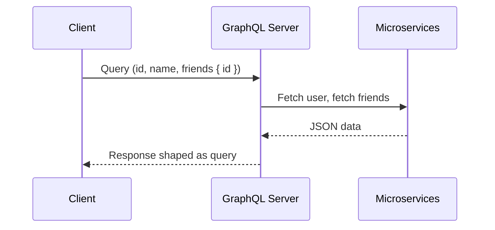

# Web-frameworks

# REST Reactive vs Virtual Threads in Java: Modern Approaches to Scalable Web Applications

## Introduction

Java web development is evolving rapidly to meet the demands of modern, highly scalable web applications. Two prominent approaches—**REST Reactive** (e.g., Spring WebFlux, Quarkus RESTEasy Reactive, Vert.x) and **Virtual Threads** (Project Loom)—offer different paradigms for handling concurrent, high-load web workloads. Additionally, **gRPC** and **GraphQL** are modern protocols that challenge traditional REST in terms of efficiency, contract enforcement, and developer experience.

This article compares all four approaches, explores their system design, performance impacts, and provides recommendations for choosing the right model for your next (or existing) web project. We’ll also cover how they perform with different HTTP content types, and demonstrate typical system architectures with sequence diagrams.

---

## Table of Contents

1. [What are REST Reactive, Virtual Threads, gRPC, and GraphQL?](#what-are-rest-reactive-virtual-threads-grpc-and-graphql)
2. [Blocking vs Non-Blocking: The Core Difference](#blocking-vs-non-blocking-the-core-difference)
3. [Framework Comparison Table](#framework-comparison-table)
4. [Performance with Heavy Load and Multiple Content Types](#performance-with-heavy-load-and-multiple-content-types)
5. [Deployment Sizing: How Many Pods?](#deployment-sizing-how-many-pods)
6. [Pros and Cons: New & Existing Projects](#pros-and-cons-new--existing-projects)
7. [System Design & Sequence Diagrams](#system-design--sequence-diagrams)
8. [Conclusion](#conclusion)

---

## What are REST Reactive, Virtual Threads, gRPC, and GraphQL?

### REST Reactive

* **Asynchronous, non-blocking programming model**
* Uses event loops and callbacks (Project Reactor, RxJava, Vert.x)
* Examples: **Spring WebFlux**, **Quarkus RESTEasy Reactive**, **Vert.x**
* Designed for massive concurrency and IO-heavy workloads

### Virtual Threads

* Introduced in Java 21 (Project Loom)
* **Lightweight threads** managed by the JVM (not OS)
* Enables thread-per-request model with minimal overhead
* Lets you write code in a traditional imperative style, but at massive scale
* Examples: **Spring Boot (Virtual Thread Executor)**, **Helidon Níma**

### gRPC

* Remote Procedure Call framework using **HTTP/2 and Protobuf**
* Bi-directional streaming, contract-first design
* Strongly typed, efficient binary encoding
* Examples: **grpc-java**, **Micronaut gRPC**, **Quarkus gRPC**

### GraphQL

* Flexible query language for APIs
* Reduces over-fetching and under-fetching
* Strongly typed, introspective API contracts
* Examples: **Netflix DGS Framework**, **Spring GraphQL**, **Apollo Java Server**

---

## Blocking vs Non-Blocking: The Core Difference

| Model                       | How it Works                                                                                                            | Pros                                                                    | Cons                                                                    |
| --------------------------- | ----------------------------------------------------------------------------------------------------------------------- | ----------------------------------------------------------------------- | ----------------------------------------------------------------------- |
| **Blocking**                | Each request gets an OS thread. If IO or external call blocks, thread is "stuck" until done.                            | Simple, familiar, easy migration.                                       | Poor scalability; lots of memory & threads needed for high concurrency. |
| **Non-Blocking (Reactive)** | Few threads handle many requests as events. Threads are never blocked by IO; work resumes when IO completes.            | Scales massively, low resource use, ideal for slow IO / streaming.      | New programming model, harder debugging.                                |
| **Virtual Threads**         | Each request gets a virtual thread (very lightweight, managed by JVM). Blocking code is fine; threads are much cheaper. | Scales almost as well as reactive, easy migration, blocking code works. | Still new, not all thread-local patterns work the same.                 |
| **gRPC**                    | Binary, contract-first communication over HTTP/2. Efficient for internal APIs and polyglot systems.                     | Fast, compact, supports streaming.                                      | Steeper learning curve, less human-readable.                            |
| **GraphQL**                 | Clients define exactly what data they need. Ideal for front-end flexibility.                                            | Reduces payload size, adaptive to frontend needs.                       | Overhead in query parsing and response shaping.                         |

---

## Framework Comparison Table

| Framework                 | Model               | Scalability | Latency under Load | Streaming Support | Ecosystem Maturity | Protocol |
| ------------------------- | ------------------- | ----------- | ------------------ | ----------------- | ------------------ | -------- |
| Spring MVC                | Blocking            | Low         | High (queueing)    | Weak              | Very High          | REST     |
| Spring WebFlux            | Reactive            | High        | Low                | Good              | High               | REST     |
| Quarkus Classic           | Blocking            | Low         | High               | Weak              | Medium             | REST     |
| Quarkus RESTEasy Reactive | Reactive            | High        | Low                | Excellent         | Growing            | REST     |
| Vert.x                    | Reactive            | Highest     | Lowest             | Best              | High (DIY toolkit) | REST     |
| Java with Virtual Threads | Blocking (scalable) | High        | Low                | Good              | Newer, improving   | REST     |
| grpc-java / Quarkus gRPC  | Non-blocking        | Very High   | Very Low           | Excellent         | High               | gRPC     |
| Spring GraphQL / DGS      | Async               | High        | Medium             | Good              | Growing            | GraphQL  |

---

## Performance with Heavy Load and Multiple Content Types

### Scenario

* **Infra:** 1 core CPU, 4 GB RAM per Kubernetes pod
* **Load:** 4 crore (40 million) requests/day (\~463/sec)

  * p95 latency: 4–10 seconds (heavy IO, SOAP-to-JSON parsing)
* **Content types:** JSON, XML, Protobuf, NDJSON, PDF, images, YAML, etc.

### Observations

| Approach                   | Throughput per Pod | Notes                                        |
| -------------------------- | ------------------ | -------------------------------------------- |
| Blocking (MVC)             | \~20 req/sec       | High thread usage, poor IO scaling           |
| Reactive (WebFlux, Vert.x) | 500–1000 req/sec   | Great for streaming and slow IO              |
| Virtual Threads            | \~300–600 req/sec  | Easy migration, great for IO-bound workloads |
| gRPC                       | \~1000+ req/sec    | Highly efficient with Protobuf               |
| GraphQL                    | \~300–500 req/sec  | Depends on query complexity                  |

#### Content-Type Considerations

| Media Type         | Blocking Perf | Reactive Perf | gRPC      | GraphQL | Notes                           |
| ------------------ | ------------- | ------------- | --------- | ------- | ------------------------------- |
| JSON/Protobuf      | Good          | Excellent     | Best      | Good    | Fastest to parse/serialize      |
| XML/SOAP           | Poor          | Good          | N/A       | N/A     | CPU-heavy, reactive helps scale |
| PDF/Images/Binary  | Good          | Excellent     | Best      | Weak    | Streamed, gRPC/reactive shine   |
| NDJSON/EventStream | Weak          | Excellent     | Excellent | Limited | Reactive/gRPC best suited       |
| YAML               | Poor          | Poor-Good     | N/A       | Poor    | Avoid for high-traffic APIs     |
| Multipart/Form     | Good          | Good          | N/A       | N/A     | Slightly more overhead          |

---

## Deployment Sizing: How Many Pods?

**Blocking (Spring MVC, Quarkus Classic):**

* Max 20–30 req/sec per pod (with heavy IO/latency)
* For 463 req/sec: **16–24 pods needed**

**Reactive / Virtual Threads / gRPC / GraphQL:**

* 300–1000 req/sec per pod (IO-bound, streaming)
* For 463 req/sec: **1–2 pods (use 2–3 for HA and burst capacity)**

---

## Pros and Cons: New & Existing Projects

### Blocking (Spring MVC, Quarkus Classic)

**Pros:**

* Mature, easy migration for legacy Java EE/Spring apps
* Large ecosystem, familiar to most Java devs

**Cons:**

* Poor scalability for high concurrency and slow IO
* High infrastructure cost, thread pool exhaustion risk

### Reactive (WebFlux, RESTEasy Reactive, Vert.x)

**Pros:**

* Massive scalability and resource efficiency
* Best for streaming, high-latency APIs
* Fewer pods, lower infra cost

**Cons:**

* Steep learning curve (reactive, async, backpressure)
* Debugging and stack traces more complex

### Virtual Threads

**Pros:**

* Easy to migrate from blocking code
* Familiar thread-per-request style, but highly scalable
* Resource-efficient for IO-bound work

**Cons:**

* Still maturing; some frameworks/tools catching up
* Not ideal for CPU-bound tasks

### gRPC

**Pros:**

* Compact, fast binary format
* Good for internal microservice communication
* Supports bi-directional streaming

**Cons:**

* Harder to debug, non-human readable
* Less natural for public APIs

### GraphQL

**Pros:**

* Frontend flexibility
* One endpoint for multiple resource needs
* Introspective schema

**Cons:**

* Complex caching and performance tuning
* Overhead in building flexible resolvers

---

## System Design & Sequence Diagrams

### 1. Blocking (Spring MVC)

### 2. Reactive (WebFlux / Vert.x)

### 3. Virtual Threads (Java 21+)

### 4. gRPC Architecture

### 5. GraphQL Resolver

---

## Conclusion

**Reactive**, **Virtual Threads**, **gRPC**, and **GraphQL** each offer high scalability for modern web workloads:

* **For new Java projects:** Start with **Reactive**, **Virtual Threads**, or **gRPC** depending on your communication model.
* **For internal APIs:** Use **gRPC** for performance and binary efficiency.
* **For frontend/backend integration:** Use **GraphQL** for flexibility.
* **For migrating legacy code:** Use **Virtual Threads**.

**Summary Table:**

| Approach        | Scalability | Latency  | Ease of Migration | Streaming | Infra Cost | Best Used For                |
| --------------- | ----------- | -------- | ----------------- | --------- | ---------- | ---------------------------- |
| Blocking (MVC)  | Low         | High     | Easy              | Weak      | High       | Legacy apps                  |
| Reactive        | High        | Low      | Steep curve       | Excellent | Low        | IO-bound, streaming          |
| Virtual Threads | High        | Low      | Easy              | Good      | Low        | Migrating to scalable APIs   |
| gRPC            | Very High   | Very Low | Medium            | Excellent | Low        | Internal APIs, microservices |
| GraphQL         | High        | Medium   | Medium            | Good      | Medium     | Client-driven APIs           |

**Choose the right tool for your use case—and architect for scale from the start!**
