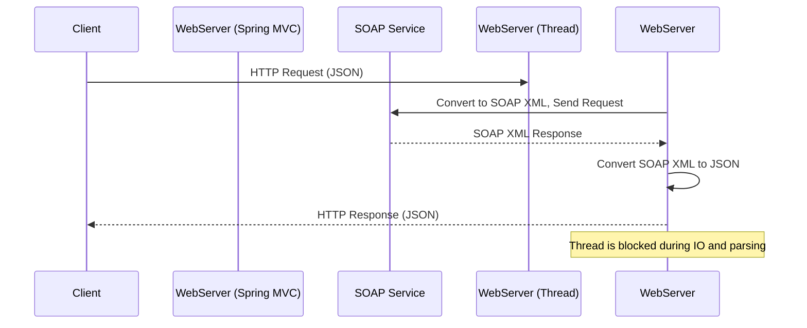
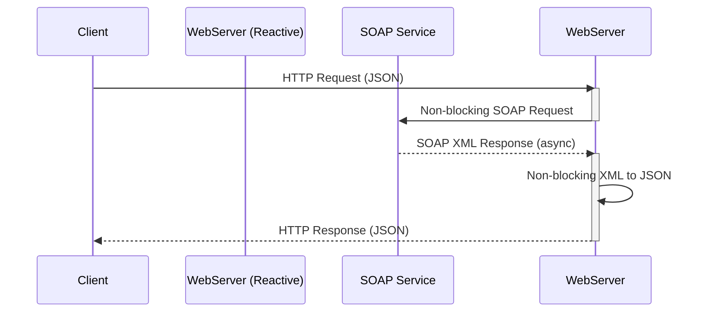
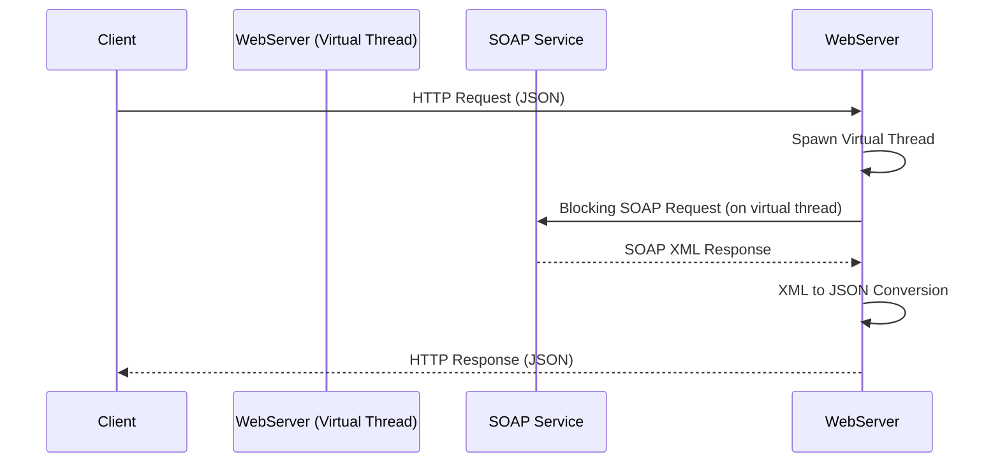

# Web-frameworks

# REST Reactive vs Virtual Threads in Java: Modern Approaches to Scalable Web Applications

## Introduction

Java web development is evolving rapidly to meet the demands of modern, highly scalable web applications. Two prominent approaches—**REST Reactive** (e.g., Spring WebFlux, Quarkus RESTEasy Reactive, Vert.x) and **Virtual Threads** (Project Loom)—offer different paradigms for handling concurrent, high-load web workloads.

This article compares both approaches, explores their system design, performance impacts, and provides recommendations for choosing the right model for your next (or existing) web project. We’ll also cover how they perform with different HTTP content types, and demonstrate typical system architectures with sequence diagrams.

---

## Table of Contents

1. [What are REST Reactive and Virtual Threads?](#what-are-rest-reactive-and-virtual-threads)
2. [Blocking vs Non-Blocking: The Core Difference](#blocking-vs-non-blocking-the-core-difference)
3. [Framework Comparison Table](#framework-comparison-table)
4. [Performance with Heavy Load and Multiple Content Types](#performance-with-heavy-load-and-multiple-content-types)
5. [Deployment Sizing: How Many Pods?](#deployment-sizing-how-many-pods)
6. [Pros and Cons: New & Existing Projects](#pros-and-cons-new--existing-projects)
7. [System Design & Sequence Diagrams](#system-design--sequence-diagrams)
8. [Conclusion](#conclusion)

---

## What are REST Reactive and Virtual Threads?

### REST Reactive

- **Asynchronous, non-blocking programming model**
- Uses event loops and callbacks (Project Reactor, RxJava, Vert.x)
- Examples: **Spring WebFlux**, **Quarkus RESTEasy Reactive**, **Vert.x**
- Designed for massive concurrency and IO-heavy workloads

### Virtual Threads

- Introduced in Java 21 (Project Loom)
- **Lightweight threads** managed by the JVM (not OS)
- Enables thread-per-request model with minimal overhead
- Lets you write code in a traditional imperative style, but at massive scale

---

## Blocking vs Non-Blocking: The Core Difference

| Model         | How it Works | Pros | Cons |
|---------------|--------------|------|------|
| **Blocking**  | Each request gets an OS thread. If IO or external call blocks, thread is "stuck" until done. | Simple, familiar, easy migration. | Poor scalability; lots of memory & threads needed for high concurrency. |
| **Non-Blocking (Reactive)** | Few threads handle many requests as events. Threads are never blocked by IO; work resumes when IO completes. | Scales massively, low resource use, ideal for slow IO / streaming. | New programming model, harder debugging. |
| **Virtual Threads** | Each request gets a virtual thread (very lightweight, managed by JVM). Blocking code is fine; threads are much cheaper. | Scales almost as well as reactive, easy migration, blocking code works. | Still new, not all thread-local patterns work the same. |

---

## Framework Comparison Table

| Framework                 | Model      | Scalability | Latency under Load | Streaming Support | Ecosystem Maturity |
|---------------------------|------------|-------------|--------------------|-------------------|--------------------|
| Spring MVC                | Blocking   | Low         | High (queueing)    | Weak              | Very High          |
| Spring WebFlux            | Reactive   | High        | Low                | Good              | High               |
| Quarkus Classic           | Blocking   | Low         | High               | Weak              | Medium             |
| Quarkus RESTEasy Reactive | Reactive   | High        | Low                | Excellent         | Growing            |
| Vert.x                    | Reactive   | Highest     | Lowest             | Best              | High (DIY toolkit) |
| Java with Virtual Threads | Blocking (but scalable) | High | Low         | Good              | Newer, improving   |

---

## Performance with Heavy Load and Multiple Content Types

### Scenario

- **Infra:** 1 core CPU, 4 GB RAM per Kubernetes pod
- **Load:** 4 crore (40 million) requests/day (~463/sec)
  - p95 latency: 4–10 seconds (heavy IO, SOAP-to-JSON parsing)
- **Content types:** JSON, XML, Protobuf, NDJSON, PDF, images, YAML, etc.

### Observations

- **Blocking (Spring MVC, Quarkus Classic):**
  - Each slow request occupies a thread; threads are limited by memory and CPU.
  - With 100 threads and avg latency of 5s: max throughput ≈ 20 req/sec per pod.
  - **Needs 20+ pods for 463 req/sec.**

- **Reactive (WebFlux, Quarkus RESTEasy Reactive, Vert.x):**
  - Event loop handles thousands of concurrent requests on few threads.
  - Can handle 500–1000 concurrent IO-bound req/sec per pod.
  - **Needs only 1–2 pods for same throughput (with headroom, use 2–3 pods).**

- **Virtual Threads:**
  - Each request gets a lightweight thread; JVM manages them efficiently.
  - Comparable throughput to reactive for IO-bound work.
  - **Needs 2–3 pods for 463 req/sec.**

#### Content-Type Considerations

| Media Type         | Blocking Perf | Reactive Perf | Notes                           |
|--------------------|--------------|--------------|---------------------------------|
| JSON/Protobuf      | Good         | Excellent    | Fastest to parse/serialize      |
| XML/SOAP           | Poor         | Good         | CPU-heavy, reactive helps scale |
| PDF/Images/Binary  | Good         | Excellent    | Streamed, reactive shines       |
| NDJSON/EventStream | Weak         | Excellent    | Reactive handles streaming best |
| YAML               | Poor         | Poor-Good    | Slow, avoid for high-traffic    |
| Multipart/Form     | Good         | Good         | Slightly more overhead          |

---

## Deployment Sizing: How Many Pods?

**Blocking (Spring MVC, Quarkus Classic):**

- Max 20–30 req/sec per pod (with heavy IO/latency)
- For 463 req/sec: **16–24 pods needed**

**Reactive/Virtual Threads:**

- 300–600 req/sec per pod (IO-bound, streaming)
- For 463 req/sec: **1–2 pods (use 2–3 for high availability)**

---

## Pros and Cons: New & Existing Projects

### **Spring MVC / Quarkus Classic (Blocking)**

**Pros:**
- Mature, easy migration for legacy Java EE/Spring apps
- Large ecosystem, familiar to most Java devs

**Cons:**
- Poor scalability for high concurrency and slow IO
- High infrastructure cost, risk of thread pool exhaustion

### **Spring WebFlux / Quarkus RESTEasy Reactive / Vert.x (Reactive)**

**Pros:**
- Massive scalability and resource efficiency
- Best for streaming, high-latency or slow-IO APIs
- Fewer pods, lower infra cost

**Cons:**
- Steep learning curve (reactive, async, backpressure)
- Some blocking libraries (e.g., JDBC) may need workarounds
- Debugging is harder

### **Virtual Threads**

**Pros:**
- Easy to migrate from blocking code
- Familiar thread-per-request style, but highly scalable
- Resource-efficient for IO-bound work

**Cons:**
- Still new; JVM and frameworks adapting
- Not ideal for heavy CPU-bound workloads

---

## System Design & Sequence Diagrams

### 1. Blocking (Spring MVC / Classic) Sequence

### 2. Reactive (Spring WebFlux / Quarkus RESTEasy Reactive / Vert.x)
####  Note over WebServer: Event loop reuses threads; more concurrent requests

### 3. Virtual Threads (Java 21+)

#### Note over WebServer: Each request is a lightweight thread; blocking is efficient

---

## Conclusion

**Reactive frameworks** (Spring WebFlux, Quarkus RESTEasy Reactive, Vert.x) and **Virtual Threads** both offer high scalability for IO-bound workloads and complex content types. 

- **For new projects:** Start with reactive or virtual threads for the best scalability, especially if you expect high concurrency or streaming demands.
- **For existing projects:** Virtual threads offer a gentler migration path with familiar code, while reactive is ideal if you’re ready for a paradigm shift and need to support heavy streaming or event-driven workloads.
- **For blocking/legacy libraries:** Virtual threads are the best drop-in option.

**Summary Table:**

| Approach           | Scalability | Latency | Ease of Migration | Streaming | Infra Cost |
|--------------------|-------------|---------|-------------------|-----------|------------|
| Blocking (MVC)     | Low         | High    | Easy              | Weak      | High       |
| Reactive           | High        | Low     | Steep curve       | Excellent | Low        |
| Virtual Threads    | High        | Low     | Easy              | Good      | Low        |

**Choose the right tool for your use case—and architect for scale from the start!**

---
