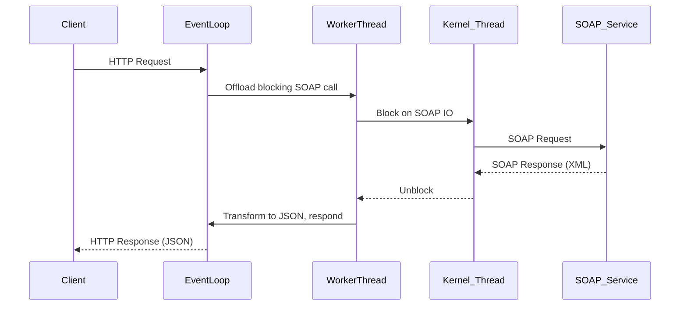
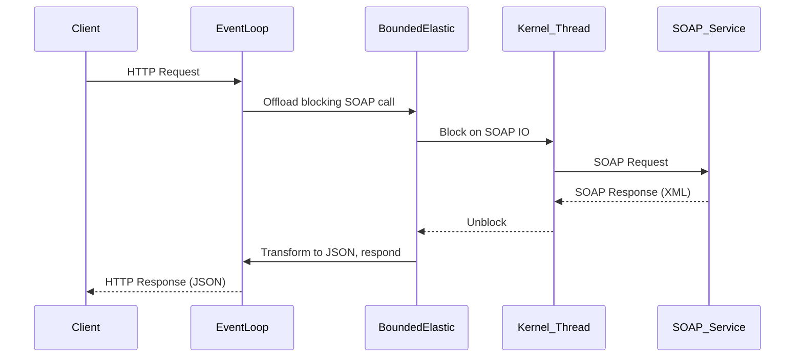
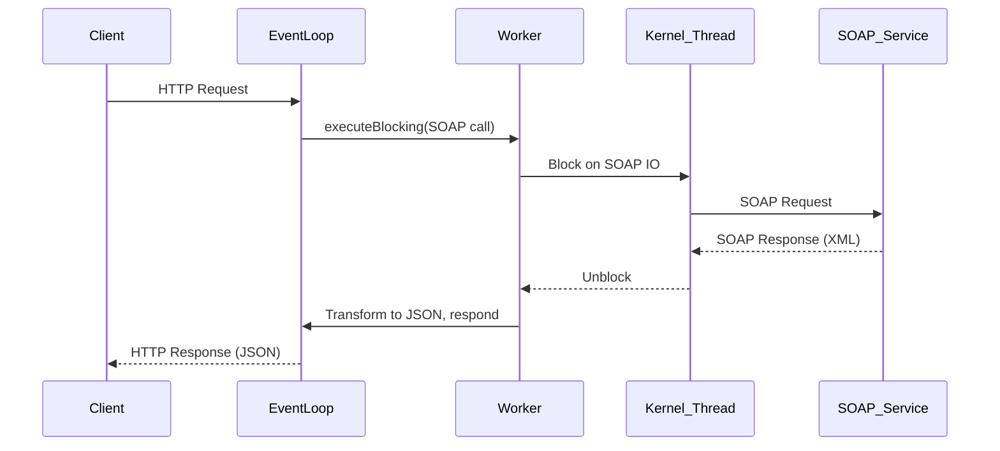
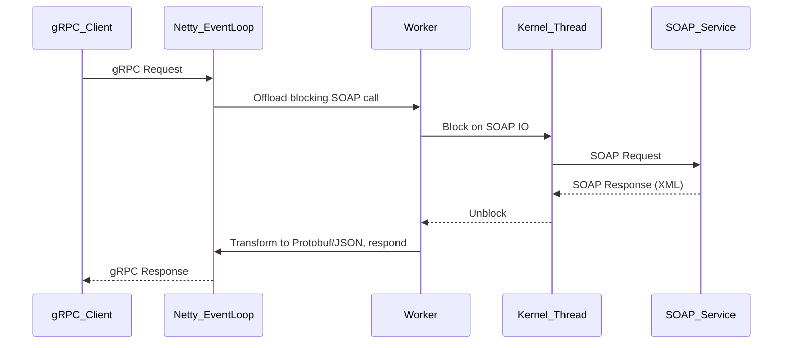

# A Deep Dive into Modern Java Server Models: MVC, Quarkus, Spring WebFlux, RESTEasy Reactive, Vert.x, gRPC, GraphQL, and Spring MVC with/without Virtual Threads

**Author:** [Your Name]  
**Audience:** Software Architects, Senior Java Developers  
**Scenario:** Design a SOAP-to-JSON API under heavy IO load (1-core CPU, 4GB RAM, 40M req/day, P95 latency 4-10s, event-streaming for some APIs).  
**Format:** Modular sections; diagrams and tables; code snippets; Kubernetes sizing; real-world constraints.

---

## Table of Contents

- [Introduction](#introduction)
- [Common Scenario & Constraints](#common-scenario--constraints)
- [Technology Sections](#technology-sections)
  - [Spring MVC (Traditional & with Virtual Threads)](#spring-mvc-traditional--with-virtual-threads)
  - [Quarkus (RESTEasy & RESTEasy Reactive)](#quarkus-resteasy--resteasy-reactive)
  - [Spring WebFlux](#spring-webflux)
  - [Vert.x](#vertx)
  - [gRPC](#grpc)
  - [GraphQL](#graphql)
- [Cross-Model Media Type Performance Comparison](#cross-model-media-type-performance-comparison)
- [Summary Table & Recommendations](#summary-table--recommendations)
- [References](#references)

---

## Introduction

Modern Java server frameworks offer various concurrency and IO models, each with different trade-offs in thread usage, scalability, and suitability for high-latency, high-throughput workloads. This post provides a technical deep-dive into the most popular models and frameworks, focusing on how they handle a real-world, IO-heavy SOAP-to-JSON transformation workload under severe hardware constraints.

---

## Common Scenario & Constraints

- **Hardware:** 1-core CPU, 4GB RAM per pod
- **Traffic:** 40M requests/day (~463 req/s avg), P95 latency 4–10s per request
- **Processing:** Each request does a blocking third-party SOAP call, transforms the XML to JSON, and responds.
- **Streaming APIs:** 10M requests/day event-streamed; rest are standard HTTP.
- **Kubernetes:** Sizing required for the above load.
- **Media Types:** JSON, XML, CBOR, Protobuf, GraphQL, NDJSON, YAML, PDF, images, multipart, event-stream, plain text, markdown, atom, RSS, etc.

---

## Technology Sections

Each section follows this structure:

1. Overview
2. Internal Execution Model
3. Threading (platform, virtual, event loop)
4. Blocking vs. Non-blocking IO
5. Sequence Diagram
6. Request Lifecycle (with SOAP-to-JSON)
7. Resource Utilization (CPU, Memory, Threads)
8. Kubernetes Sizing Calculation
9. Performance with Different Media Types
10. Pros and Cons
11. Best Use Cases

---

### Spring MVC (Traditional & with Virtual Threads)

#### 1. Overview

Spring MVC is the classic Java Servlet-based web framework. By default, it uses a thread-per-request model backed by a thread pool (usually Tomcat/Jetty). With JDK 21+, it can leverage virtual threads, dramatically altering resource usage patterns.

#### 2. Internal Execution Model

- **Traditional:** Each HTTP request is assigned a platform thread from a pool.
- **With Virtual Threads:** Each HTTP request is assigned a lightweight virtual thread.

#### 3. Threading

| Model                   | Thread Type        | Thread Usage        |
|-------------------------|-------------------|---------------------|
| Traditional             | Platform (kernel) | 1 per concurrent req|
| With Virtual Threads    | Virtual           | 1 per concurrent req, but much lighter |

#### 4. Blocking vs. Non-blocking IO

- **Traditional:** Blocking. Each thread waits for IO (e.g., SOAP call).
- **Virtual Threads:** Still blocking, but threads are cheap; kernel threads only needed during actual IO operations.

#### 5. Sequence Diagram

```mermaid
sequenceDiagram
    participant Client
    participant HTTP_Server
    participant (Virtual) Thread
    participant Kernel_Thread
    participant SOAP_Service

    Client->>HTTP_Server: HTTP Request
    HTTP_Server->>+(Virtual) Thread: Assign thread
    (Virtual) Thread->>Kernel_Thread: Block on SOAP IO
    Kernel_Thread->>SOAP_Service: SOAP Request
    SOAP_Service-->>Kernel_Thread: SOAP Response (XML)
    Kernel_Thread-->>(Virtual) Thread: Unblock
    (Virtual) Thread->>HTTP_Server: Transform to JSON, respond
    HTTP_Server-->>Client: HTTP Response (JSON)
```

- **Blocking Points:** During SOAP call.
- **Kernel Thread Usage:** In virtual thread model, kernel threads are only occupied during actual IO (see [Loom docs](https://openjdk.org/projects/loom/)).

#### 6. Request Lifecycle (SOAP-to-JSON)

```java
@RestController
public class SoapToJsonController {
    @GetMapping("/api/data")
    public Map<String, Object> handle() {
        // This blocks the thread (platform or virtual)
        String xml = callSoapServiceBlocking();
        return parseXmlToJson(xml);
    }
}
```

#### 7. Resource Utilization

- **Traditional:** If there are 100 concurrent requests (all waiting on IO), need ~100 platform threads.
- **Virtual:** Can easily handle 1000s of concurrent requests, limited mainly by heap and kernel threads for IO.

#### 8. Kubernetes Sizing Calculation

**Assumptions:**
- 40M req/day ≈ 463 rps avg; peak could be 2x (≈900 rps).
- Each request occupies thread for 4–10s (P95).

**Max Concurrent Requests:**  
`max_concurrent = rps * latency = 900 * 10 = 9000`

- **Traditional:** Need 9000 platform threads → not feasible on 1-core/4GB pod (Tomcat default max is 200).
- **Virtual:** 9000 virtual threads is feasible. Kernel threads spike only during network IO.

**Pod Sizing Table:**

| Model          | Max Concurrent | Threads Needed | Pods Required (peak) |
|----------------|----------------|---------------|----------------------|
| Traditional    | ~200           | ~200          | 45                   |
| Virtual Loom   | ~9000          | ~9000 virtual | 1–2                  |

#### 9. Media Type Performance

| Media Type         | Support | Deserialization Performance | Notes                                             |
|--------------------|---------|----------------------------|---------------------------------------------------|
| JSON               | ✔       | Fast                       | Native support, Jackson/Gson                      |
| XML                | ✔       | Moderate                   | JAXB, Jackson-XML                                 |
| CBOR, Protobuf     | ✔ (via modules) | Fast           | Needs extra libs                                  |
| GraphQL            | ✖ (needs plugin) | N/A           | Not native                                        |
| NDJSON, YAML       | ✔       | Moderate                   | Needs Jackson modules                             |
| PDF, images        | ✔       | Slow                       | Handled as binary streams                         |
| Multipart, streams | ✔       | Moderate/slow              | Servlet multipart, blocking by default            |
| Atom/RSS/XML       | ✔       | Moderate                   | Standard support                                  |

#### 10. Pros and Cons

| Pros                                            | Cons                                          |
|-------------------------------------------------|-----------------------------------------------|
| Simple, well-known, mature                      | Thread-per-request model wastes resources under high IO latency |
| Easy to debug/blocking code                     | Not scalable with platform threads            |
| Loom (virtual threads) makes blocking code scalable | Virtual threads are new, less battle-tested   |

#### 11. Best Use Cases

- **Traditional:** Small-scale, low-latency, low-concurrency.
- **Virtual Threads:** High-latency IO, high concurrency, SOAP-to-JSON transformer, minimal code changes.

---

### Quarkus (RESTEasy & RESTEasy Reactive)

#### 1. Overview

Quarkus supports both traditional (RESTEasy) and reactive (RESTEasy Reactive) models, optimized for cloud-native and GraalVM. RESTEasy is thread-per-request; RESTEasy Reactive uses event loops and non-blocking IO.

#### 2. Internal Execution Model

- **RESTEasy:** Servlet-based, thread-per-request.
- **RESTEasy Reactive:** Event-loop, non-blocking, small thread pool for blocking tasks.

#### 3. Threading

| Model               | Threading      | Usage                                      |
|---------------------|----------------|---------------------------------------------|
| RESTEasy            | Platform       | Thread-per-request                          |
| RESTEasy Reactive   | Event Loop + Worker | Event loop for non-blocking, offload blocking to worker threads |

#### 4. Blocking vs. Non-blocking IO

- **RESTEasy:** Blocking.
- **RESTEasy Reactive:** Non-blocking by default, blocking operations offloaded to worker pool.

#### 5. Sequence Diagram (RESTEasy Reactive)



#### 6. Request Lifecycle (SOAP-to-JSON)

```java
@Path("/api")
public class SoapResource {
    @GET
    @Path("/data")
    @Blocking // for RESTEasy Reactive
    public Uni<Response> getData() {
        // blocking SOAP call, offloaded to worker thread
        String xml = callSoapServiceBlocking();
        return Uni.createFrom().item(parseXmlToJson(xml));
    }
}
```

#### 7. Resource Utilization

- **RESTEasy:** Same as Spring MVC Traditional.
- **RESTEasy Reactive:** Event loop threads handle non-blocking; blocking calls consume worker threads (configurable pool).

#### 8. Kubernetes Sizing

- **RESTEasy:** Same as Spring MVC traditional (see table above).
- **RESTEasy Reactive:** Number of worker threads determines max concurrency for blocking calls; can scale pool size, but beware context switching/CPU starvation.

#### 9. Media Type Performance

| Media Type      | RESTEasy Support | RESTEasy Reactive Support | Notes         |
|-----------------|------------------|--------------------------|---------------|
| JSON, XML, CBOR | ✔                | ✔                        | Native        |
| Protobuf        | ✔ (with ext)     | ✔                        |               |
| GraphQL         | ✖ (plugin)       | ✖ (plugin)               |               |
| Streams         | Limited          | ✔ (reactive streams)     |               |
| PDF, images     | ✔                | ✔                        |               |

#### 10. Pros and Cons

| Pros                  | Cons                               |
|-----------------------|------------------------------------|
| Fast startup, low memory (Quarkus) | RESTEasy Reactive less mature |
| RESTEasy Reactive: async, non-blocking | Need to mark blocking endpoints explicitly |
| Good for native builds              | Offloaded blocking can still saturate pool |

#### 11. Best Use Cases

- **RESTEasy:** Legacy, simple IO.
- **RESTEasy Reactive:** Cloud-native, high concurrency, mixed blocking/non-blocking, event APIs.

---

### Spring WebFlux

#### 1. Overview

Spring WebFlux is a fully non-blocking, reactive web framework, built on Project Reactor. It uses event loops and backpressure to maximize resource usage.

#### 2. Internal Execution Model

- Event loop + small worker pool.
- Reactive streams principles (Publisher/Subscriber).

#### 3. Threading

- Few threads (Netty event loops), backpressure-aware.
- Blocking calls (e.g., SOAP) must be offloaded to a bounded elastic scheduler.

#### 4. Blocking vs. Non-blocking IO

- **Non-blocking:** for in-memory and reactive endpoints.
- **Blocking:** must be moved to dedicated thread pool (boundedElastic).

#### 5. Sequence Diagram



#### 6. Request Lifecycle (SOAP-to-JSON)

```java
@GetMapping("/data")
public Mono<Map<String, Object>> getData() {
    return Mono.fromCallable(() -> callSoapServiceBlocking())
        .subscribeOn(Schedulers.boundedElastic())
        .map(this::parseXmlToJson);
}
```

#### 7. Resource Utilization

- Small number of event loop threads.
- Bounded elastic pool handles blocking IO (configurable, default 10x CPU count).

#### 8. Kubernetes Sizing

- **Blocking calls dominate:** Number of bounded elastic threads = max concurrent requests.
- For 9000 concurrent, set pool size accordingly; pod count as per resource limits.

#### 9. Media Type Performance

| Media Type        | Support | Notes                                  |
|-------------------|---------|----------------------------------------|
| JSON, XML         | ✔       | Native                                 |
| Protobuf, CBOR    | ✔       | Needs extensions                       |
| GraphQL           | ✖       | Needs plugin                           |
| NDJSON, streams   | ✔       | Excellent for streaming                |
| PDF, images       | ✔       | Handled as DataBuffer                  |

#### 10. Pros and Cons

| Pros                                          | Cons                            |
|-----------------------------------------------|---------------------------------|
| Extremely scalable non-blocking event loop    | Blocking IO needs careful offloading |
| Native streaming support                      | Debugging reactive code is harder|
| Backpressure-aware                            | High learning curve              |

#### 11. Best Use Cases

- Streaming APIs.
- High-concurrency, IO-bound workloads with some blocking (offloaded).
- Event-driven microservices.

---

### Vert.x

#### 1. Overview

Vert.x is a toolkit for building reactive applications on the JVM. It uses a small number of event loop threads and offloads blocking operations to worker pools.

#### 2. Internal Execution Model

- Event loop (single-threaded per core).
- Blocking operations offloaded to worker threads.

#### 3. Threading

- Event loops (few per core).
- Worker pool for blocking IO.

#### 4. Blocking vs. Non-blocking IO

- Pure non-blocking is optimal.
- Blocking (like SOAP) must use `executeBlocking`.

#### 5. Sequence Diagram



#### 6. Request Lifecycle (SOAP-to-JSON)

```java
router.get("/data").handler(ctx -> {
    vertx.<Map<String, Object>>executeBlocking(promise -> {
        String xml = callSoapServiceBlocking();
        promise.complete(parseXmlToJson(xml));
    }, res -> ctx.response().end(toJson(res.result())));
});
```

#### 7. Resource Utilization

- Event loop: minimal CPU, never blocked.
- Worker threads: bounded pool, handles blocking IO.

#### 8. Kubernetes Sizing

- Size worker pool for expected concurrency (same as WebFlux boundedElastic).
- Pods: similar calculations.

#### 9. Media Type Performance

| Media Type | Support | Notes                         |
|------------|---------|------------------------------|
| JSON, XML  | ✔       | Native, fast                 |
| Protobuf   | ✔       | Needs extension              |
| Streaming  | ✔       | EventBus, streams supported  |

#### 10. Pros and Cons

| Pros                   | Cons                            |
|------------------------|---------------------------------|
| Scalable, efficient    | Must offload blocking IO        |
| Polyglot               | Not as mature as Spring         |
| Event-driven           | Complex for newcomers           |

#### 11. Best Use Cases

- Event-driven, non-blocking microservices.
- APIs with mixed blocking/non-blocking workloads.

---

### gRPC

#### 1. Overview

gRPC is a high-performance, open-source RPC framework using HTTP/2 and Protocol Buffers. It’s fully non-blocking and designed for low-latency, high-throughput inter-service communication.

#### 2. Internal Execution Model

- Netty-based, async/non-blocking.
- Application code can be blocking or async.

#### 3. Threading

- Few Netty event loops.
- Blocking code must be offloaded to worker threads.

#### 4. Blocking vs. Non-blocking IO

- gRPC core is non-blocking.
- Blocking SOAP call → must use thread pool.

#### 5. Sequence Diagram



#### 6. Request Lifecycle (SOAP-to-JSON)

```java
@Override
public void getData(Request req, StreamObserver<Response> resp) {
    Executors.newSingleThreadExecutor().submit(() -> {
        String xml = callSoapServiceBlocking();
        resp.onNext(transform(xml));
        resp.onCompleted();
    });
}
```

#### 7. Resource Utilization

- Event loop: minimal.
- Worker threads: as needed for blocking IO.

#### 8. Kubernetes Sizing

- Similar to WebFlux/Vert.x for blocking IO.
- gRPC is not ideal for browser clients (needs HTTP/2), but excels for service-to-service.

#### 9. Media Type Performance

| Media Type         | Support | Notes                              |
|--------------------|---------|------------------------------------|
| Protobuf           | ✔       | Native, fastest                    |
| JSON, XML          | ✔       | Needs marshalling                  |
| Streaming          | ✔       | Bi-directional streams             |
| GraphQL, YAML      | ✖       | Not native                         |
| PDF, images        | ✔       | Byte streams                       |

#### 10. Pros and Cons

| Pros                        | Cons                         |
|-----------------------------|------------------------------|
| High performance, HTTP/2    | Not browser/client friendly  |
| Bi-directional streaming    | Schema-first (Protobuf)      |
| Excellent for internal APIs | Less flexible media types    |

#### 11. Best Use Cases

- Internal microservices, high throughput, low-latency.
- Service-to-service with Protobuf or binary data.

---

### GraphQL

#### 1. Overview

GraphQL exposes a flexible query language over HTTP. Common Java servers: graphql-java, Spring GraphQL, DGS.

#### 2. Internal Execution Model

- Usually built on top of WebFlux or MVC.
- Request parsing, field resolvers, optional async.

#### 3. Threading

- Depends on underlying transport (MVC: thread-per-request, WebFlux: event loop).

#### 4. Blocking vs. Non-blocking IO

- Field resolvers can be async (CompletableFuture).
- Blocking IO must be offloaded if using reactive backend.

#### 5. Sequence Diagram

```mermaid
sequenceDiagram
    participant Client
    participant Server
    participant (Virtual) Thread or EventLoop
    participant Worker/Kernel_Thread
    participant SOAP_Service

    Client->>Server: GraphQL Query
    Server->>(Virtual) Thread or EventLoop: Parse & plan
    (Virtual) Thread or EventLoop->>Worker/Kernel_Thread: SOAP call per field (blocking)
    Worker/Kernel_Thread->>SOAP_Service: SOAP Request
    SOAP_Service-->>Worker/Kernel_Thread: SOAP Response (XML)
    Worker/Kernel_Thread-->>(Virtual) Thread or EventLoop: Unblock
    (Virtual) Thread or EventLoop->>Server: Aggregate, serialize JSON
    Server-->>Client: HTTP Response (JSON)
```

#### 6. Request Lifecycle (SOAP-to-JSON)

```java
public class QueryResolver implements GraphQLQueryResolver {
    public CompletableFuture<Map<String, Object>> getData() {
        return CompletableFuture.supplyAsync(() -> {
            String xml = callSoapServiceBlocking();
            return parseXmlToJson(xml);
        });
    }
}
```

#### 7. Resource Utilization

- Depends on transport/execution (see previous models).
- Multiple field resolvers per request may increase thread usage.

#### 8. Kubernetes Sizing

- Similar to WebFlux/MVC, but field resolver fan-out may require more threads.

#### 9. Media Type Performance

| Media Type  | Support | Notes                        |
|-------------|---------|------------------------------|
| JSON        | ✔       | Native                       |
| XML         | ✖       | Not native                   |
| Protobuf    | ✖       | Not native                   |
| GraphQL     | ✔       | Native                       |
| Streaming   | ✔ (subscriptions) | Event streams       |

#### 10. Pros and Cons

| Pros                            | Cons                                  |
|----------------------------------|---------------------------------------|
| Flexible queries, strong schema  | Only JSON, chatty for simple APIs     |
| Aggregates multiple sources      | N+1 problem, field resolver overhead  |
| Supports subscriptions          | More complex to tune for blocking IO  |

#### 11. Best Use Cases

- APIs where clients need control over data shape.
- Aggregating multiple backends.
- Streaming/subscription APIs.

---

## Cross-Model Media Type Performance Comparison

| Media Type                 | Spring MVC | MVC + VT | RESTEasy | RESTEasy Reactive | WebFlux | Vert.x | gRPC   | GraphQL |
|----------------------------|------------|----------|----------|-------------------|---------|--------|--------|---------|
| APPLICATION_JSON           | ✔️         | ✔️       | ✔️       | ✔️                | ✔️      | ✔️     | ✔️     | ✔️      |
| APPLICATION_XML            | ✔️         | ✔️       | ✔️       | ✔️                | ✔️      | ✔️     | ✔️     | ✖️      |
| APPLICATION_CBOR           | ✔️(mod)    | ✔️(mod)  | ✔️(mod)  | ✔️(mod)           | ✔️(mod) | ✔️(mod)| ✖️     | ✖️      |
| APPLICATION_PROTOBUF       | ✖️(mod)    | ✖️(mod)  | ✔️(mod)  | ✔️(mod)           | ✔️(mod) | ✔️(mod)| ✔️     | ✖️      |
| APPLICATION_GRAPHQL        | ✖️         | ✖️       | ✖️       | ✖️                | ✖️     | ✖️    | ✖️    | ✔️      |
| APPLICATION_NDJSON         | ✔️         | ✔️       | ✔️       | ✔️                | ✔️      | ✔️     | ✖️     | ✖️      |
| APPLICATION_YAML           | ✔️(mod)    | ✔️(mod)  | ✔️(mod)  | ✔️(mod)           | ✔️(mod) | ✔️(mod)| ✖️     | ✖️      |
| APPLICATION_PDF            | ✔️         | ✔️       | ✔️       | ✔️                | ✔️      | ✔️     | ✔️     | ✖️      |
| IMAGE_*                    | ✔️         | ✔️       | ✔️       | ✔️                | ✔️      | ✔️     | ✔️     | ✖️      |
| MULTIPART_FORM_DATA        | ✔️         | ✔️       | ✔️       | ✔️                | ✔️      | ✔️     | ✖️     | ✖️      |
| TEXT_EVENT_STREAM          | ✔️         | ✔️       | ✔️       | ✔️                | ✔️      | ✔️     | ✔️     | ✔️      |
| TEXT_MARKDOWN              | ✔️         | ✔️       | ✔️       | ✔️                | ✔️      | ✔️     | ✖️     | ✖️      |
| APPLICATION_RSS_XML        | ✔️         | ✔️       | ✔️       | ✔️                | ✔️      | ✔️     | ✖️     | ✖️      |
| APPLICATION_ATOM_XML       | ✔️         | ✔️       | ✔️       | ✔️                | ✔️      | ✔️     | ✖️     | ✖️      |

- ✔️: Native or easy plugin; (mod): needs module; ✖️: Not applicable/natively supported.

**Performance Notes:**
- **JSON/Protobuf/CBOR:** Binary (Protobuf/CBOR) is fastest for serialization/deserialization and wire size; JSON is ubiquitous but slower.
- **XML/YAML/Markdown:** Heavier parsing, higher CPU/memory.
- **Images/PDF/Multipart:** Streamed/buffered, CPU-light but memory-intensive if not chunked.
- **Event Streams/NDJSON:** WebFlux, Vert.x, and gRPC excel.
- **GraphQL:** Only JSON; other types require custom extensions.

---

## Summary Table & Recommendations

### Recommendation Matrix

| Load/Latency/Type   | Best Model(s)                  | Why                                              |
|---------------------|-------------------------------|--------------------------------------------------|
| High-latency IO     | Spring MVC (Virtual Threads), WebFlux, Vert.x | Efficient thread usage, easy blocking code (Loom), or native async |
| Streaming/Event API | WebFlux, Vert.x, gRPC         | Best for reactive/event-driven, backpressure      |
| Protobuf/Binary     | gRPC, RESTEasy Reactive       | Native support, fast wire format                  |
| JSON/XML            | Any (with Loom prefer virtual threads, else WebFlux/Vert.x) | Universal, good support everywhere               |
| Mixed Media         | Vert.x, WebFlux, Quarkus      | Polyglot, plugin support, scalable                |
| Resource-limited    | MVC+VT, WebFlux, Vert.x       | Minimal platform threads, high concurrency        |
| GraphQL             | Spring GraphQL, DGS           | Flexible queries, subscriptions                   |

### Sizing Example (per pod, 1-core, 4GB RAM, 4-10s latency)

| Model             | Max Concurrent | Threads Needed      | Pods for Peak (900 rps) |
|-------------------|---------------|---------------------|-------------------------|
| Spring MVC        | ~200          | 200                 | 45                      |
| MVC + Loom        | ~9000         | 9000 virtual        | 1–2                     |
| WebFlux/Vert.x    | ~9000         | ~9000 worker/elastic| 1–2                     |
| RESTEasy Reactive | ~9000         | ~9000 worker        | 1–2                     |
| gRPC              | ~9000         | ~9000 worker        | 1–2                     |
| GraphQL           | Dep. on impl  | (see above)         | (see above)             |

---

## Conclusion

- **Spring MVC (Virtual Threads):** Best for drop-in scalability on blocking IO, legacy codebases.
- **WebFlux/Vert.x:** Ideal for new, reactive, streaming, or mixed workloads.
- **gRPC:** Best for internal, high-performance, Proto-based APIs.
- **GraphQL:** Great for flexible, aggregated data APIs—watch thread usage per field.
- **Pod Sizing:** With Loom, Vert.x, or WebFlux, 1–2 pods can suffice for 900 rps with 4–10s latency, thanks to efficient thread usage. Traditional thread-per-request models require 20–50x more pods.

---

## References

- [OpenJDK Loom](https://openjdk.org/projects/loom/)
- [Spring WebFlux Documentation](https://docs.spring.io/spring-framework/docs/current/reference/html/web-reactive.html)
- [Quarkus RESTEasy Reactive Guide](https://quarkus.io/guides/resteasy-reactive)
- [Vert.x Documentation](https://vertx.io/docs/)
- [gRPC Java Guide](https://grpc.io/docs/languages/java/)
- [Spring GraphQL](https://spring.io/projects/spring-graphql)
- [Real-world benchmarks: TechEmpower](https://www.techempower.com/benchmarks/#section=data-r21)

---

```
