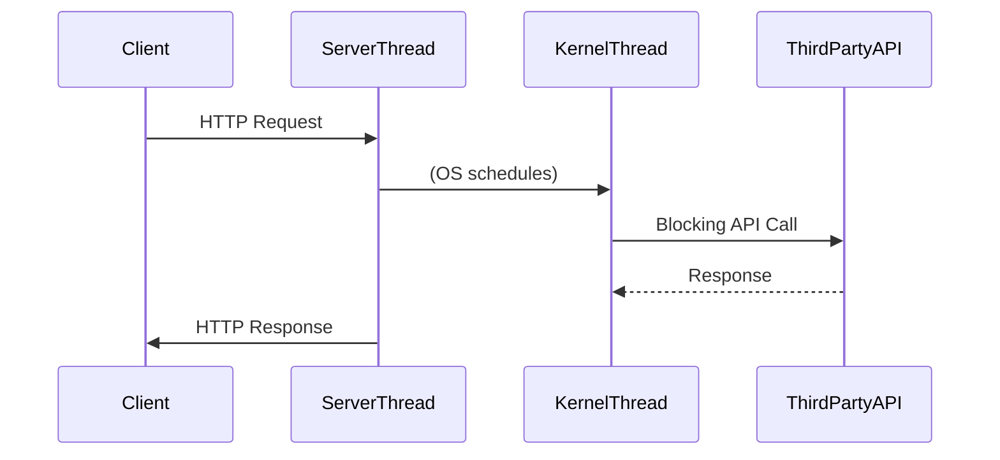
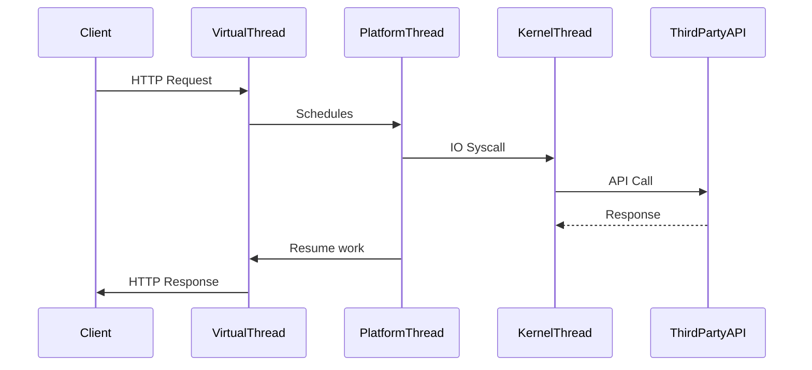
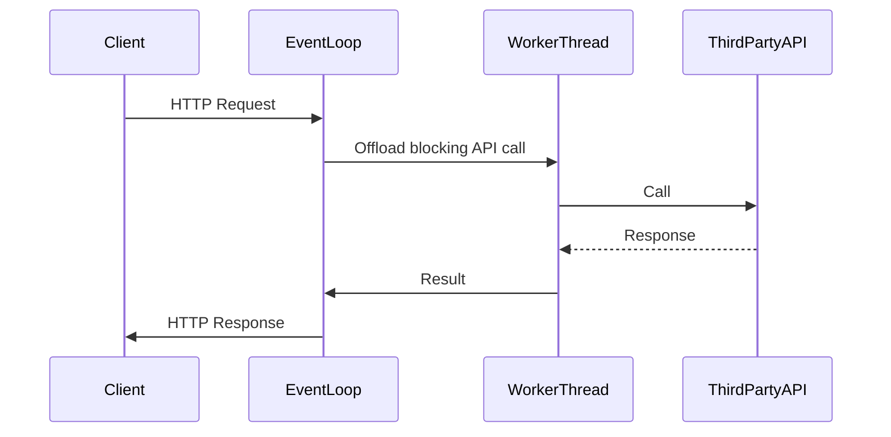
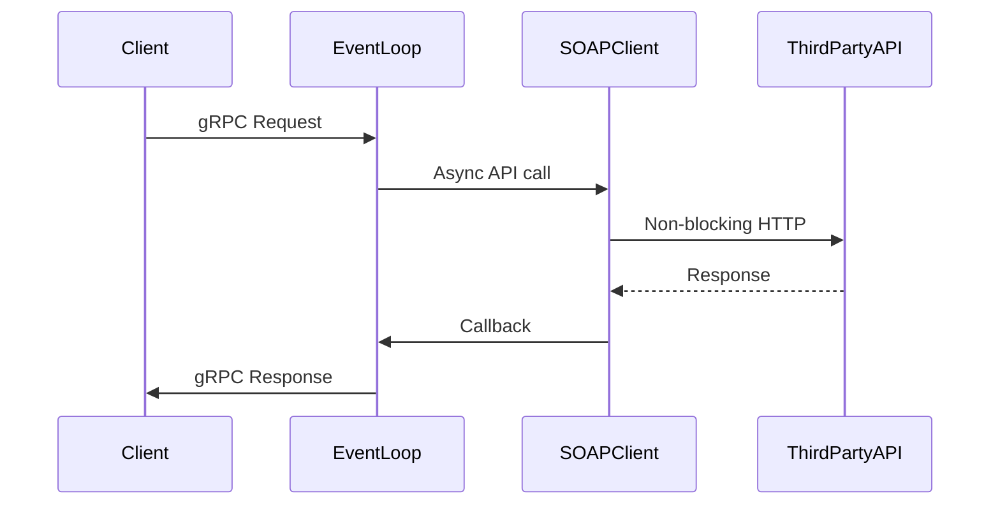
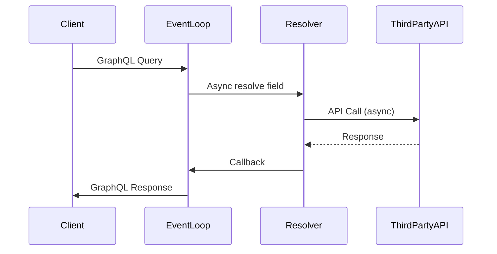

# A Deep Dive into Modern Java Server Models  
### Comparing MVC, Quarkus (RESTEasy & RESTEasy Reactive), Spring WebFlux, Vert.x, gRPC, GraphQL, and Spring MVC (with/without Virtual Threads) for High-Latency Third-Party API Workloads

---

## Table of Contents

1. [Introduction & Problem Scenario](#introduction--problem-scenario)
2. [Evaluation Criteria & Architecture Scenario](#evaluation-criteria--architecture-scenario)
3. [Model Deep Dives](#model-deep-dives)
    - [MVC (Traditional Servlet)](#mvc-traditional-servlet)
    - [Spring MVC with Virtual Threads](#spring-mvc-with-virtual-threads)
    - [Quarkus (RESTEasy & RESTEasy Reactive)](#quarkus-resteasy--resteasy-reactive)
    - [Spring WebFlux](#spring-webflux)
    - [Vert.x](#vertx)
    - [gRPC](#grpc)
    - [GraphQL](#graphql)
4. [Cross-Model Media Type Performance](#cross-model-media-type-performance)
5. [Kubernetes Sizing & Resource Utilization](#kubernetes-sizing--resource-utilization)
6. [Summary Table & Recommendations](#summary-table--recommendations)
7. [References](#references)

---

## Introduction & Problem Scenario

Modern Java server frameworks offer a variety of models for handling web traffic, including classic thread-per-request, reactive/event loop, and hybrid approaches. High-latency, high-throughput workloads—such as a server with **1-core CPU, 4GB RAM**, and **40 million requests/day** (P95 latency: 4–10s; each request makes a third-party call with 10–60s response time)—push these models to their limits.

**Key constraints:**
- 1-core CPU, 4GB RAM per pod (Kubernetes)
- 40 million requests/day (≈463 req/sec average)
- Each request: high-latency third-party API call (10–60s)
- Event-streaming APIs: 10 million/day
- Wide range of media types: JSON, XML, CBOR, Protobuf, GraphQL, NDJSON, YAML, PDF, images, multipart, event-streams, etc.

---

## Evaluation Criteria & Architecture Scenario

For each model/technology, we evaluate:
- Internal Execution Model (threading, event loops, blocking/non-blocking IO)
- Sequence Diagram (client, server thread/event loop/virtual thread, kernel thread, third-party API, response)
- Resource Utilization (CPU, Memory, Threads)
- Kubernetes Sizing Calculation (pods required)
- Performance with Media Types
- Pros/Cons & Best Use Cases

---

## Model Deep Dives

### MVC (Traditional Servlet)

#### Overview
Classic Java web server model: each HTTP request handled by a dedicated **platform thread** from a pool (e.g., Tomcat, Jetty, Spring MVC default).

#### Internal Execution Model
- **Thread-per-request**: Each request mapped to a platform thread.
- **Blocking IO**: Thread blocks for all IO (e.g., third-party API call).

#### Threading
- **Platform Threads** (OS/kernel threads): Limited (~100–400 per pod before memory/CPU thrashing).
- High-latency IO means most threads spend time blocked.

#### Blocking vs. Non-blocking IO
- **Blocking**: Each thread waits for IO.
- Not scalable for high-latency third-party calls.

#### Sequence Diagram

**Blocking points:** Thread blocked on third-party call.

#### Resource Utilization
- **CPU:** Underutilized (threads mostly block).
- **Memory:** High (each thread ~1MB stack).
- **Threads:** Thread pool size limits concurrency.

#### Kubernetes Sizing Calculation
- Avg concurrency ≈ `requests/sec × P95 latency` ≈ `463 × 10s = 4630` concurrent requests.
- Needs 4630 threads; with 300 threads/pod (practical), needs `≈16 pods`.
- But **1-core CPU** can't run 300+ kernel threads efficiently (context switch overhead).

#### Performance with Media Types
| Media Type     | Support | Latency | Memory | Notes                                        |
|----------------|---------|---------|--------|----------------------------------------------|
| JSON/XML       | ✔️      | High    | High   | Native, but serialization/deserialization blocks a thread |
| Protobuf/CBOR  | ⚠️      | High    | High   | Needs extra libs, not idiomatic              |
| Images/PDF     | ✔️      | High    | High   | Streaming blocks a thread                    |
| NDJSON/Stream  | ✔️      | High    | High   | Each client holds a thread                   |
| GraphQL        | ⚠️      | High    | High   | Not a native fit                             |
| Others         | ✔️      | High    | High   | All blocking                                 |

#### Pros and Cons
| Pros               | Cons                                              |
|--------------------|--------------------------------------------------|
| Mature, familiar   | Not scalable for IO-bound workloads              |
| Simple debugging   | High memory/thread overhead                      |
| Broad media support| Thread pool exhaustion, bad for long-latency APIs|

#### Best Use Cases
- Low concurrency, CPU-bound, fast IO APIs.

---

### Spring MVC with Virtual Threads

#### Overview
Modernized thread-per-request model using **Java Virtual Threads (Project Loom)**.

#### Internal Execution Model
- Each request: **virtual thread** (lightweight, millions possible).
- Virtual thread blocks for IO, kernel thread reused elsewhere.

#### Threading
- **Virtual Threads**: Multiplexed onto a small pool of platform threads.
- Platform threads ~1/core.

#### Blocking vs. Non-blocking IO
- **Blocking IO**: Virtual thread blocks, not a platform thread.
- Dramatically improves scalability for IO-bound workloads.

#### Sequence Diagram

**Blocking:** Only virtual thread blocked, platform thread is free.

#### Resource Utilization
- **CPU:** Efficient, minimal context switching.
- **Memory:** Low (virtual thread stack = few KB).
- **Threads:** 10,000s possible per pod.

#### Kubernetes Sizing Calculation
- 4630 concurrent requests = 4630 virtual threads (few MB RAM).
- **Pods needed:** `~2–3` (limited by CPU/network, not threads).

#### Performance with Media Types
| Media Type     | Support | Latency | Memory | Notes                     |
|----------------|---------|---------|--------|---------------------------|
| All            | ✔️      | Med     | Low    | Blocking safe, broad support |

#### Pros and Cons
| Pros             | Cons                                      |
|------------------|-------------------------------------------|
| Code stays simple| Loom is new (ecosystem support maturing)  |
| Scales IO-bound  | Not as efficient as pure async for CPU    |

#### Best Use Cases
- High-latency IO, legacy code, easy migration.

---

### Quarkus (RESTEasy & RESTEasy Reactive)

#### Overview
- **RESTEasy:** Classic blocking JAX-RS (like servlet).
- **RESTEasy Reactive:** Event-loop, async/worker pool hybrid.

#### Internal Execution Model
- **RESTEasy:** Thread-per-request (see MVC above).
- **RESTEasy Reactive:** Event loop for HTTP, worker pool for blocking code.

#### Threading
- **Reactive:** Event loop (~1/core), worker pool for blocking IO.

#### Blocking vs. Non-blocking IO
- **Blocking IO:** Offloaded to worker thread pool.
- **Non-blocking IO:** Handled by event loop.

#### Sequence Diagram (Reactive)

**Blocking:** Only worker thread blocked.

#### Resource Utilization
- **CPU:** Event loop efficient, workers limit blocking IO concurrency.
- **Memory:** Moderate (worker threads ~256–512/pod).

#### Kubernetes Sizing Calculation
- 400 workers/pod × 1-core = 12 pods for 4630 concurrency.

#### Performance with Media Types
| Media Type     | Support | Latency | Memory | Notes                    |
|----------------|---------|---------|--------|--------------------------|
| All            | ✔️      | Med     | Med    | Broad codec support      |

#### Pros and Cons
| Pros             | Cons                               |
|------------------|------------------------------------|
| Hybrid async     | Worker pool limits blocking scaling|
| Fast startup     | Mixed code complexity              |

#### Best Use Cases
- Hybrid loads, microservices, migration from blocking to async.

---

### Spring WebFlux

#### Overview
Fully **reactive, non-blocking** web stack.

#### Internal Execution Model
- Uses event loops (Netty, Reactor).
- All IO is async/non-blocking.

#### Threading
- **Event Loop Threads:** Few per pod (e.g., 4–8).
- No thread-per-request.

#### Blocking vs. Non-blocking IO
- **Non-blocking IO throughout**.
- Blocking code must be offloaded (should be avoided).

#### Sequence Diagram

**No thread is blocked on IO.**

#### Resource Utilization
- **CPU:** Very efficient.
- **Memory:** Low.
- **Threads:** Event loop only (4–8).

#### Kubernetes Sizing Calculation
- 2–3 pods can handle 40M/day (limited by network/CPU, not threads).

#### Performance with Media Types
| Media Type     | Support | Latency | Memory | Notes                        |
|----------------|---------|---------|--------|------------------------------|
| All            | ✔️      | Low     | Low    | Optimized codecs, streaming  |

#### Pros and Cons
| Pros             | Cons                                      |
|------------------|-------------------------------------------|
| Scales massive IO| Steep learning curve (reactive paradigm)  |
| Efficient        | Not all libraries are reactive-compatible  |

#### Best Use Cases
- High-latency, high-concurrency IO; streaming/event APIs.

---

### Vert.x

#### Overview
Asynchronous, **event-driven toolkit** for reactive apps.

#### Internal Execution Model
- Netty event loops for networking.
- Worker pool for blocking code.

#### Threading
- **Event Loop:** ~2 × core count.
- Worker pool for blocking IO.

#### Blocking vs. Non-blocking IO
- **Non-blocking IO:** Event loop.
- **Blocking IO:** Offloaded to worker threads.

#### Sequence Diagram

**Same as Quarkus Reactive.**

#### Resource Utilization
- **CPU:** Efficient for async.
- **Memory:** Worker pool size is limit.

#### Kubernetes Sizing Calculation
- 400 workers/pod ⇒ 12 pods for 4630 concurrency.

#### Performance with Media Types
| Media Type     | Support | Latency | Memory | Notes                       |
|----------------|---------|---------|--------|-----------------------------|
| All            | ✔️      | Low     | Low    | Polyglot, broad support     |

#### Pros and Cons
| Pros             | Cons                              |
|------------------|-----------------------------------|
| High concurrency | Async code complexity             |

#### Best Use Cases
- Real-time APIs, streaming, event-driven.

---

### gRPC

#### Overview
Binary, **async-by-default** RPC framework (HTTP/2, Protobuf).

#### Internal Execution Model
- Netty event loops for HTTP/2.
- Async handlers; streaming built-in.

#### Threading
- **Event Loop:** ~core count.
- Async handlers.

#### Blocking vs. Non-blocking IO
- **Non-blocking IO** if async handlers.
- **Blocking IO** must be offloaded.

#### Sequence Diagram

**No thread blocks if all async.**

#### Resource Utilization
- **CPU:** Very efficient.
- **Memory:** Low.
- **Threads:** Event loop only.

#### Kubernetes Sizing Calculation
- 2–3 pods suffice.

#### Performance with Media Types
| Media Type     | Support | Latency | Memory | Notes                           |
|----------------|---------|---------|--------|---------------------------------|
| Protobuf/CBOR  | ✔️      | Low     | Low    | Native, binary                  |
| JSON/XML       | ⚠️      | Low     | Low    | Needs conversion                |
| Others         | ⚠️      | Low     | Low    | Needs marshallers               |

#### Pros and Cons
| Pros                | Cons                        |
|---------------------|----------------------------|
| Efficient, streaming| Not browser-friendly       |
| HTTP/2 multiplexing | Limited media flexibility  |

#### Best Use Cases
- Backend-to-backend, high performance, streaming.

---

### GraphQL

#### Overview
Flexible query API; execution model depends on server (blocking/async).

#### Internal Execution Model
- Query parsed, resolvers invoked (may be async or blocking).

#### Threading
- **Depends:** Servlet (blocking), async GraphQL (event loop).

#### Blocking vs. Non-blocking IO
- **Async:** Efficient; **blocking:** same as MVC.

#### Sequence Diagram (Async)

**Blocking depends on resolver implementation.**

#### Resource Utilization
- **Async:** Efficient; **blocking:** thread pool limited.

#### Kubernetes Sizing Calculation
- Async: 2–3 pods; Blocking: 12–16 pods.

#### Performance with Media Types
| Media Type     | Support | Latency | Memory | Notes                      |
|----------------|---------|---------|--------|----------------------------|
| GraphQL        | ✔️      | Low     | Low    | Native                     |
| JSON           | ✔️      | Low     | Low    |                            |
| Others         | ⚠️      | Low     | Low    | Custom scalars/resolvers   |

#### Pros and Cons
| Pros              | Cons                              |
|-------------------|-----------------------------------|
| Flexible queries  | N+1 resolver problem              |
| Frontend-friendly | May not fit REST use cases        |

#### Best Use Cases
- Aggregate APIs, frontend-driven, async resolvers.

---

## Cross-Model Media Type Performance

| Media Type                   | MVC | MVC+VT | QuarkusR | WebFlux | Vert.x | gRPC | GraphQL |
|------------------------------|-----|--------|----------|---------|--------|------|---------|
| JSON, XML                    | ✔️  | ✔️     | ✔️       | ✔️      | ✔️     | ⚠️   | ✔️      |
| Protobuf, CBOR               | ⚠️  | ⚠️     | ✔️       | ✔️      | ✔️     | ✔️   | ⚠️      |
| GraphQL                      | ⚠️  | ⚠️     | ⚠️       | ✔️      | ⚠️     | ❌   | ✔️      |
| NDJSON/Event-Stream          | ✔️  | ✔️     | ✔️       | ✔️      | ✔️     | ✔️   | ✔️      |
| Images, PDF, Multipart       | ✔️  | ✔️     | ✔️       | ✔️      | ✔️     | ⚠️   | ⚠️      |
| YAML, Atom, RSS, Markdown    | ✔️  | ✔️     | ✔️       | ✔️      | ✔️     | ⚠️   | ⚠️      |

✔️ = Native/Good, ⚠️ = With libraries/config, ❌ = Not supported

---

## Kubernetes Sizing & Resource Utilization

| Model              | Thread Model         | Threads/Pod | Pods Needed | CPU Usage | Memory Usage | Notes                          |
|--------------------|---------------------|-------------|-------------|-----------|--------------|--------------------------------|
| MVC (Servlet)      | Platform threads    | ~300        | 16          | High      | High         | Not scalable for IO            |
| MVC+VirtualThreads | Virtual threads     | ~5000       | 2–3         | Med       | Low          | Efficient, Loom                |
| Quarkus Reactive   | Event loop + workers| ~400        | 12          | Med       | Med          | Hybrid, worker pool            |
| WebFlux            | Event loop          | 8           | 2–3         | Low       | Low          | Async, best for IO             |
| Vert.x             | Event loop + workers| ~400        | 12          | Med       | Med          | Polyglot, streaming            |
| gRPC               | Event loop          | 8           | 2–3         | Low       | Low          | Protobuf, backend-to-backend   |
| GraphQL (async)    | Event loop          | 8           | 2–3         | Low       | Low          | Depends on resolver design     |

---

## Summary Table & Recommendations

| Scenario                        | Best Model(s)              | Rationale                                   |
|----------------------------------|----------------------------|---------------------------------------------|
| High-latency IO, high concurrency| WebFlux, Vert.x, gRPC      | Async, event loop, minimal resources        |
| Blocking IO, legacy code         | MVC+Virtual Threads        | Easy migration, scalable with Loom          |
| Streaming/event APIs             | WebFlux, Vert.x, gRPC      | Built-in support, efficient                 |
| Multiple media types             | WebFlux, Quarkus, Vert.x   | Broad codec support                         |
| GraphQL APIs                     | WebFlux, Async GraphQL     | Async resolvers, scalable                   |
| SOAP-to-JSON transformation      | WebFlux, MVC+VirtualThreads| Async: efficient, VT: easy migration        |

---

## References

- [Project Loom (Virtual Threads)](https://openjdk.org/projects/loom/)
- [Spring WebFlux Docs](https://docs.spring.io/spring-framework/docs/current/reference/html/web-reactive.html)
- [Quarkus RESTEasy Reactive](https://quarkus.io/guides/resteasy-reactive)
- [Vert.x Documentation](https://vertx.io/docs/)
- [gRPC Java](https://grpc.io/docs/languages/java/)
- [GraphQL Java](https://www.graphql-java.com/)
- [TechEmpower Benchmarks](https://www.techempower.com/benchmarks/)
- [Kubernetes Resource Requests & Limits](https://kubernetes.io/docs/concepts/configuration/manage-resources-containers/)

---
Absolutely! In addition to the mainstream Java server models you listed (MVC, Quarkus, Spring WebFlux, RESTEasy Reactive, Vert.x, gRPC, GraphQL, and MVC with Virtual Threads), there are several other **tech stacks and models in the Java ecosystem** designed (or proven) for IO-intensive web applications. Below is a list with a brief explanation for each:

---

## Other Java Tech Stacks/Models for IO-Intensive Web Applications

### 1. **Netty (Direct Use)**
- **Type:** NIO-based event-driven networking framework.
- **How it works:** Foundation for many frameworks (Vert.x, gRPC, RESTEasy Reactive). You can build highly optimized, non-blocking IO servers directly, with full control.
- **Best for:** Custom protocols, WebSockets, high-performance proxies, or microservices with unusual networking needs.

### 2. **Akka HTTP / Akka Streams**
- **Type:** Actor-based, reactive, event-driven.
- **How it works:** Akka Actors manage concurrency safely; Akka Streams provide backpressure-aware, non-blocking data pipelines; Akka HTTP is a reactive web server on top.
- **Best for:** Highly concurrent, stateful, or streaming APIs; where backpressure and message-driven architecture are crucial.

### 3. **Ratpack**
- **Type:** Non-blocking, asynchronous web framework.
- **How it works:** Built on Netty, provides a fluent, functional API for async HTTP handling.
- **Best for:** Microservices, APIs needing high concurrency with simple async code.

### 4. **Helidon (SE & MP)**
- **Type:** Helidon SE is a reactive, functional, non-blocking Java microframework; Helidon MP is Jakarta EE MicroProfile-compatible.
- **How it works:** Helidon SE is optimized for async/reactive; MP is more traditional.
- **Best for:** Cloud-native, microservices, with a focus on performance and small footprint.

### 5. **Micronaut**
- **Type:** Ahead-of-time (AOT) compiled, supports both blocking and non-blocking.
- **How it works:** Reactive HTTP server built on Netty, very fast startup, low memory, supports reactive streams.
- **Best for:** Serverless, microservices, high-concurrency workloads.

### 6. **Undertow**
- **Type:** Lightweight, embeddable web server (used by WildFly, Quarkus, Spring Boot).
- **How it works:** Supports both blocking and non-blocking APIs, flexible handler pipelines.
- **Best for:** Custom server deployments, microservices, WebSockets, async HTTP APIs.

### 7. **Play Framework (Java)**
- **Type:** Reactive, stateless, non-blocking web framework.
- **How it works:** Built atop Akka HTTP, supports fully async request handling.
- **Best for:** Modern web APIs, streaming, reactive microservices.

### 8. **Javalin**
- **Type:** Lightweight, async web framework.
- **How it works:** Built on top of Jetty; supports both synchronous and asynchronous handlers.
- **Best for:** Simple APIs or microservices, where minimalism and flexibility are desired.

---

## Summary Table

| Model/Stack       | Core Paradigm         | Async Support | Backpressure | Great for      | Notes                      |
|-------------------|----------------------|--------------|--------------|----------------|----------------------------|
| Netty (Raw)       | Event-Driven, NIO    | Yes          | Manual       | Custom servers | Steep learning curve       |
| Akka HTTP/Streams | Actor, Reactive      | Yes          | Yes          | Streaming APIs | JVM-interop with Scala     |
| Ratpack           | Async, Functional    | Yes          | Yes          | Microservices  | Functional style           |
| Helidon SE        | Reactive, NIO        | Yes          | Yes          | Cloud-native   | AOT, small footprint       |
| Micronaut         | Reactive/AOT         | Yes          | Yes          | Serverless     | Fast startup, GraalVM      |
| Undertow          | Blocking/Non-blocking| Yes          | Partial      | Custom servers | Embeddable, flexible       |
| Play Framework    | Reactive, Stateless  | Yes          | Yes          | Web APIs       | Scala roots, Java support  |
| Javalin           | Minimalist, Async    | Yes          | Partial      | Simple APIs    | Jetty-based, flexible      |

---

## When to Consider These

- **Custom Protocols/Ultra-Low-Latency:** Netty, Undertow (raw)
- **Backpressure/Streaming:** Akka HTTP, Akka Streams, Ratpack, Play, Helidon SE
- **Cloud-Native/Microservices:** Helidon, Micronaut, Ratpack
- **Minimalist APIs:** Javalin, Micronaut, Ratpack
- **Embeddable Servers:** Undertow, Netty

## References/Benchmarks:
- [TechEmpower Framework Benchmarks](https://www.techempower.com/benchmarks/)
- [Akka HTTP Docs](https://doc.akka.io/docs/akka-http/current/index.html)
- [Helidon SE Docs](https://helidon.io/docs/latest/se/introduction/)
- [Micronaut Docs](https://docs.micronaut.io/latest/guide/)

---

**In summary:**  
If your Java IO-intensive app needs even lower overhead, more explicit control, or a different programming paradigm than Spring/Quarkus/Vert.x, these options are worth considering. Many (like Akka, Ratpack, Helidon, Micronaut) are proven in production-grade, high-concurrency environments.

