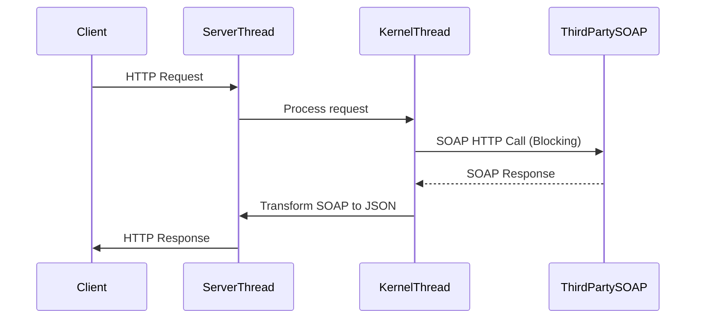
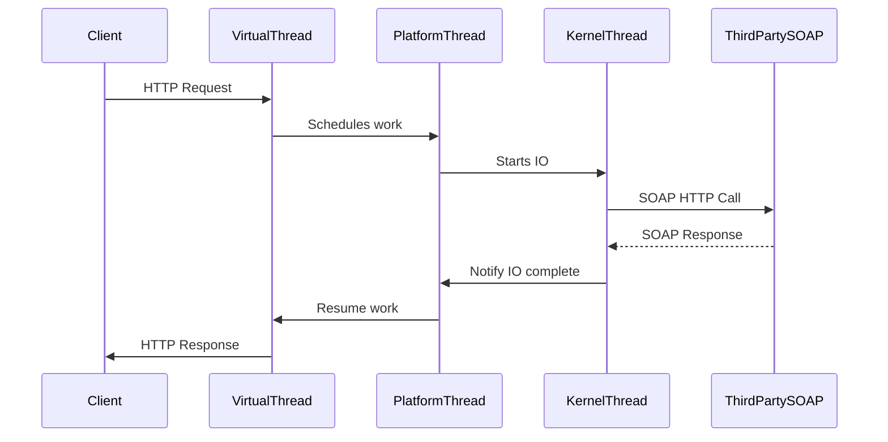
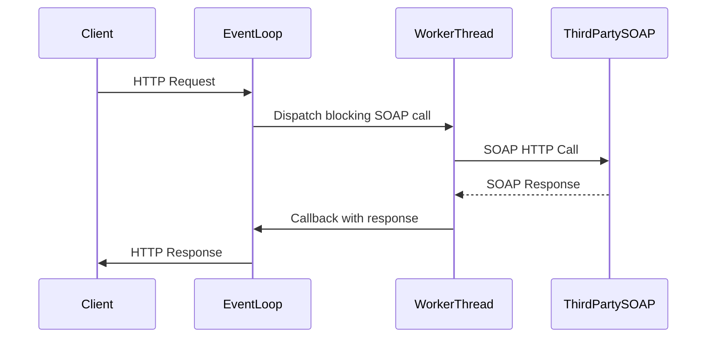
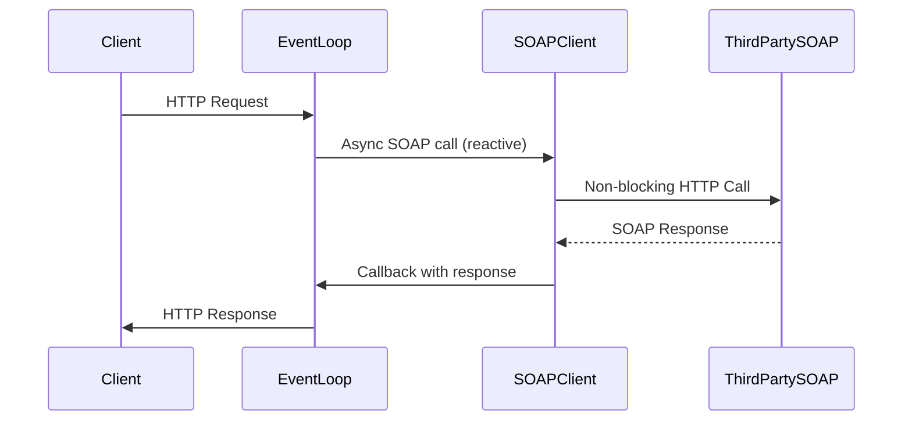
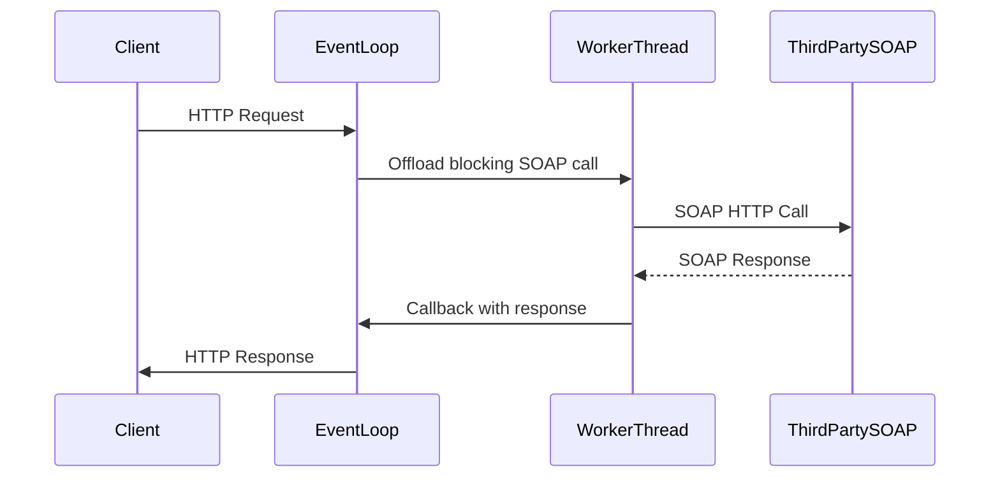
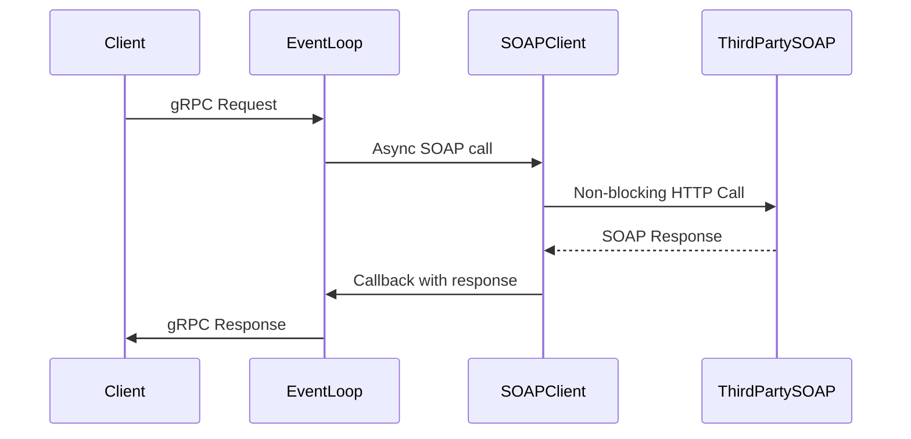
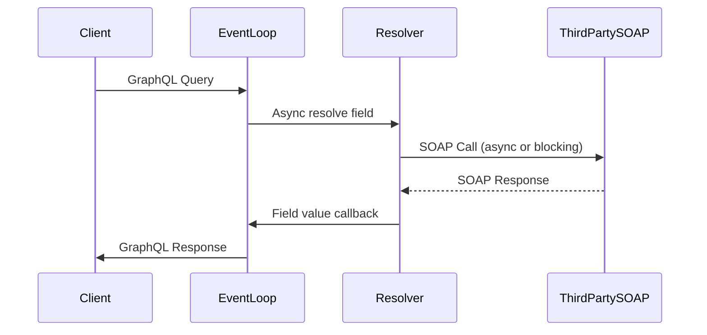

# A Deep Dive into Modern Java Server Models  
**MVC, Quarkus, Spring WebFlux, RESTEasy Reactive, Vert.x, gRPC, GraphQL, and Spring MVC (with/without Virtual Threads)**

---

## Table of Contents

1. [Introduction & Scenario](#introduction--scenario)
2. [Model Sections](#model-sections)
    - [Traditional MVC (Servlet)](#traditional-mvc-servlet)
    - [Spring MVC with Virtual Threads](#spring-mvc-with-virtual-threads)
    - [Quarkus (RESTEasy & RESTEasy Reactive)](#quarkus-resteasy--resteasy-reactive)
    - [Spring WebFlux](#spring-webflux)
    - [Vert.x](#vertx)
    - [gRPC](#grpc)
    - [GraphQL](#graphql)
3. [Cross-Model Comparison](#cross-model-comparison)
    - [Kubernetes Sizing](#kubernetes-sizing)
    - [Performance Comparison by Media Type](#performance-comparison-by-media-type)
    - [Summary Table & Recommendation Matrix](#summary-table--recommendation-matrix)
4. [References](#references)

---

## Introduction & Scenario

This post offers a deep technical comparison of modern Java server models for high-latency, high-throughput IO workloads—specifically, a SOAP-to-JSON API on a server with **1-core CPU and 4GB RAM**, handling:

- **40 million requests/day** (P95 latency: 4–10s/request)
- **Each request**: makes a third-party call (10–60s latency, e.g. SOAP)
- **Streaming/Event-driven APIs**: 10 million requests/day
- **Media types**: JSON, XML, CBOR, Protobuf, GraphQL, NDJSON, YAML, PDF, images, multipart, event-stream, text, markdown, atom, RSS, etc.

For each model, we’ll examine:

- Internal execution (threading, event loop, blocking/non-blocking IO)
- Sequence diagrams (with kernel threads, virtual threads, IO ops)
- Kubernetes sizing (pods needed for the above load)
- Performance, pros/cons, and suitability (especially for SOAP-to-JSON transformation)
- Media type handling
- Code snippets for thread/async handling

---

## Model Sections

Each section follows this structure:

- Overview
- Internal Execution Model
- Threading (platform, virtual, event loop, etc.)
- Blocking vs. Non-blocking IO
- Sequence Diagram (with blocking/non-blocking, kernel/virtual threads, SOAP call, etc.)
- Request Lifecycle (SOAP-to-JSON)
- Resource Utilization (CPU, Memory, Threads)
- Kubernetes Sizing Calculation
- Performance with Different Media Types
- Pros and Cons
- Best Use Cases

---

### Traditional MVC (Servlet)

#### Overview

- **Technology:** Spring MVC, Jakarta EE Servlets
- **Execution:** Synchronous, request-per-thread (platform threads)

#### Internal Execution Model

- Each HTTP request is handled by a **dedicated platform thread** from a pool.
- The thread is blocked during IO (e.g., SOAP call).
- Thread-pool size = max concurrent requests.

#### Threading

- **Platform Threads:** 1:1 mapping with kernel threads.
- Typical pool: 100–400 threads (CPU/memory bound).
- Blocking IO: thread blocked during network call.

#### Blocking vs. Non-blocking IO

- **Blocking IO:** Each thread waits for IO (network, SOAP).
- Inefficient for high-latency calls.

#### Sequence Diagram


- **Blocking Points:** KernelThread waits during SOAP call (occupies thread).

#### Request Lifecycle (SOAP-to-JSON)

1. HTTP request arrives, assigned a thread.
2. Thread calls SOAP (blocking).
3. On response, transforms to JSON, returns to client.

#### Resource Utilization

- **CPU:** Underutilized (threads mostly waiting on IO)
- **Memory:** High (each thread ~1MB stack)
- **Threads:** Pool size must match max concurrent requests.

#### Kubernetes Sizing Calculation

- **Throughput:** 40M/day ≈ 463 req/sec peak
- **Concurrency:** P95 = 10s → ~4630 concurrent requests
- **Threads needed:** 4630 (not feasible for 1-core/4GB; OOM & thread scheduler thrash)
- **Pods needed:** 
  - Each pod: ~300 threads before resource exhaustion
  - `4630/300 ≈ 16 pods`
- **But:** 1-core CPU can’t run 300 threads efficiently – kernel thread context switching overhead dominates.

#### Performance with Media Types

| Media Type        | Support | Latency | Memory | Notes |
|-------------------|---------|---------|--------|-------|
| JSON, XML         | ✔️      | High    | High   | Native, but serialization can be slow for large payloads |
| Protobuf, CBOR    | ❌/⚠️   | N/A     | N/A    | Needs extra libs, not idiomatic |
| Images/PDF        | ✔️      | High    | High   | Streams, but blocks thread |
| NDJSON/EventStream| ✔️      | High    | High   | Thread held for stream |
| Multipart         | ✔️      | High    | High   | Blocking |
| YAML, Atom, RSS   | ✔️      | High    | High   | Blocking |
| GraphQL           | ⚠️      | High    | High   | Not a native fit |

#### Pros and Cons

| Pros                                  | Cons                                               |
|----------------------------------------|----------------------------------------------------|
| Simplicity, mature ecosystem           | Not scalable for IO-bound workloads                |
| Easy to debug                          | High thread/memory overhead                        |
| Wide media-type support                | Thread pool exhaustion, bad for long-latency APIs  |
| Good for CPU-bound, low-latency APIs   |                                                    |

#### Best Use Cases

- Small, CPU-bound APIs
- Low request concurrency
- Short IO calls

---

### Spring MVC with Virtual Threads

#### Overview

- **Technology:** Spring MVC + Java Virtual Threads (Project Loom)
- **Execution:** One virtual thread per request (much lighter than platform threads)

#### Internal Execution Model

- Virtual threads multiplexed onto a small pool of platform threads by JVM scheduler.
- Blocking IO suspends virtual thread, platform thread can serve others.

#### Threading

- **Virtual Threads:** Thousands–millions possible.
- Platform threads ~1 per core.

#### Blocking vs. Non-blocking IO

- **Blocking IO:** But only virtual thread is blocked (not kernel thread).
- Platform threads reused efficiently.

#### Sequence Diagram


- **Blocking Point:** Virtual thread blocks, platform thread free for others.

#### Request Lifecycle (SOAP-to-JSON)

1. HTTP request assigned a virtual thread.
2. Virtual thread blocks on SOAP call.
3. On response, resumes, transforms, responds.

#### Resource Utilization

- **CPU:** Efficient use, minimal context-switching
- **Memory:** Lower (virtual thread stack ~few KB)
- **Threads:** 100,000s possible

#### Kubernetes Sizing Calculation

- **Throughput/Concurrency:** Same as above (4630 concurrent)
- **Threads needed:** 4630 virtual threads (~few MB RAM total)
- **Pods needed:** 
  - 1-core CPU: platform threads not oversubscribed
  - Likely 2–3 pods sufficient (RAM is not a limit; CPU is)

#### Performance with Media Types

| Media Type        | Support | Latency | Memory | Notes |
|-------------------|---------|---------|--------|-------|
| JSON, XML         | ✔️      | Med     | Low    | Native, non-blocking for serialization |
| Protobuf, CBOR    | ✔️      | Med     | Low    | With libs |
| Images/PDF        | ✔️      | Med     | Low    | Streams, but virtual thread suspends |
| NDJSON/EventStream| ✔️      | Med     | Low    | Virtual thread per stream |
| Multipart         | ✔️      | Med     | Low    | |
| YAML, Atom, RSS   | ✔️      | Med     | Low    | |
| GraphQL           | ✔️      | Med     | Low    | |

#### Pros and Cons

| Pros                                            | Cons                                             |
|-------------------------------------------------|--------------------------------------------------|
| Scales up IO-bound APIs easily                  | Still uses blocking APIs (not as efficient as pure async) |
| Code remains simple (looks synchronous)         | Loom is new, some ecosystem support maturing     |
| Dramatic reduction in memory/thread overhead    |                                                   |

#### Best Use Cases

- High-latency IO APIs (e.g., SOAP-to-JSON)
- High concurrency, moderate CPU

---

### Quarkus (RESTEasy & RESTEasy Reactive)

#### Overview

- **RESTEasy:** Traditional JAX-RS (blocking, servlet)
- **RESTEasy Reactive:** Non-blocking, event-loop based

#### Internal Execution Model

- **RESTEasy:** Like servlet MVC (see above)
- **RESTEasy Reactive:**
    - Uses event loops for network IO
    - Worker thread pool for blocking tasks (e.g., legacy IO)

#### Threading

- **Reactive:** Event loops (~1 per core), async handlers
- **Blocking:** Workers handle blocking code

#### Blocking vs. Non-blocking IO

- **RESTEasy:** Fully blocking (see Traditional MVC)
- **RESTEasy Reactive:** Non-blocking if possible; blocking operations dispatched to worker threads

#### Sequence Diagram (RESTEasy Reactive)


- **Blocking Point:** Worker thread blocked during SOAP call

#### Request Lifecycle (SOAP-to-JSON)

1. Event loop receives request.
2. If blocking IO, dispatch to worker.
3. On response, callback to event loop, respond.

#### Resource Utilization

- **CPU:** Event loop minimal, worker pool size critical
- **Memory:** Dependent on worker thread count (~256–512 safe)
- **Threads:** Event loop + worker pool

#### Kubernetes Sizing Calculation

- **Concurrency:** Same as above (4630)
- **Workers:** 256–512 per pod
- **Pods needed:** 4630/400 ≈ 12 pods

#### Performance with Media Types

| Media Type        | Support | Latency | Memory | Notes |
|-------------------|---------|---------|--------|-------|
| JSON, XML         | ✔️      | Med     | Med    | Native, non-blocking if possible |
| Protobuf, CBOR    | ✔️      | Med     | Med    | |
| Images/PDF        | ✔️      | Med     | Med    | Streaming |
| NDJSON/EventStream| ✔️      | Med     | Med    | |
| Multipart         | ✔️      | Med     | Med    | |
| YAML, Atom, RSS   | ✔️      | Med     | Med    | |
| GraphQL           | ✔️      | Med     | Med    | Via extension |

#### Pros and Cons

| Pros                                             | Cons                                                |
|--------------------------------------------------|-----------------------------------------------------|
| Reactive model for async/non-blocking code        | Blocking IO needs worker pool (limits scaling)      |
| Fast cold start, native compilation (Quarkus)     | Code complexity for mixing blocking/non-blocking    |
| Good media-type support                           |                                                     |

#### Best Use Cases

- Mixed workloads (some async, some blocking IO)
- Microservices with diverse endpoints

---

### Spring WebFlux

#### Overview

- **Technology:** Reactive, non-blocking, event-loop based

#### Internal Execution Model

- Uses Project Reactor (reactive streams)
- Event loop handles HTTP, user code chains via async callbacks/futures

#### Threading

- **Event Loop:** ~N threads (N = core count)
- **No thread per request:** Requests are state machines, resume on IO completion

#### Blocking vs. Non-blocking IO

- **Non-blocking IO:** All IO (HTTP, DB, SOAP with reactive client) is async; no thread blocked
- **Blocking calls must be offloaded to worker pool** (should be avoided if possible)

#### Sequence Diagram


- **No thread is blocked during IO**

#### Request Lifecycle (SOAP-to-JSON)

1. HTTP request mapped to state machine.
2. Non-blocking SOAP client makes call; event loop free for others.
3. On SOAP response, event loop resumes processing, transforms, responds.

#### Resource Utilization

- **CPU:** Very efficient (event loops only)
- **Memory:** Minimal for concurrency
- **Threads:** Event loop only (e.g., 4–8)

#### Kubernetes Sizing Calculation

- **Concurrency:** Can handle 10,000s of concurrent requests per pod
- **Pods needed:** 2–3 (network/CPU is limit, not thread count)

#### Performance with Media Types

| Media Type        | Support | Latency | Memory | Notes |
|-------------------|---------|---------|--------|-------|
| JSON, XML         | ✔️      | Low     | Low    | Native, optimized |
| Protobuf, CBOR    | ✔️      | Low     | Low    | |
| Images/PDF        | ✔️      | Low     | Low    | Streaming |
| NDJSON/EventStream| ✔️      | Low     | Low    | Native support for streaming |
| Multipart         | ✔️      | Low     | Low    | |
| YAML, Atom, RSS   | ✔️      | Low     | Low    | |
| GraphQL           | ✔️      | Low     | Low    | Via WebFlux extension |

#### Pros and Cons

| Pros                                               | Cons                                      |
|----------------------------------------------------|-------------------------------------------|
| Handles massive concurrency                        | Steep learning curve (reactive paradigm)  |
| Efficient resource usage                           | Debugging and stack traces harder         |
| Native support for streaming/event APIs            | Not all libraries are reactive-compatible |

#### Best Use Cases

- High-latency, high-concurrency IO APIs (e.g., SOAP-to-JSON)
- Streaming/event-driven APIs

---

### Vert.x

#### Overview

- **Technology:** Event-driven, polyglot, toolkit for building reactive apps
- **Execution:** Event loops (Netty), async all the way

#### Internal Execution Model

- Event loop threads handle network IO, user code
- Blocking code must be explicitly offloaded to worker pools

#### Threading

- **Event Loop:** ~2x core count
- **Worker Pool:** For legacy/blocking IO

#### Blocking vs. Non-blocking IO

- **Non-blocking IO:** Highly efficient if all code is async
- **Blocking IO:** Handled by worker threads

#### Sequence Diagram


- **Blocking Point:** Worker thread if blocking SOAP client is used

#### Request Lifecycle (SOAP-to-JSON)

- Non-blocking client: full event loop
- Blocking (legacy) client: worker thread

#### Resource Utilization

- **CPU:** Event loop efficient, worker pool size limits blocking IO scaling
- **Memory:** Low unless many workers

#### Kubernetes Sizing Calculation

- **Concurrency:** Event loop can handle 10,000s, workers for blocking
- **Pods needed:** If blocking SOAP, same as Quarkus RESTEasy Reactive (~12 pods)

#### Performance with Media Types

| Media Type        | Support | Latency | Memory | Notes |
|-------------------|---------|---------|--------|-------|
| JSON, XML         | ✔️      | Low     | Low    | |
| Protobuf, CBOR    | ✔️      | Low     | Low    | |
| Images/PDF        | ✔️      | Low     | Low    | |
| NDJSON/EventStream| ✔️      | Low     | Low    | |
| Multipart         | ✔️      | Low     | Low    | |
| YAML, Atom, RSS   | ✔️      | Low     | Low    | |
| GraphQL           | ⚠️      | Low     | Low    | Needs extra libs |

#### Pros and Cons

| Pros                                      | Cons                                  |
|-------------------------------------------|---------------------------------------|
| Handles high concurrency and streaming    | Async code can be complex to manage   |
| Polyglot, flexible                        | Blocking IO needs careful offloading  |

#### Best Use Cases

- Real-time, streaming, event-driven APIs
- High-latency IO if using non-blocking clients

---

### gRPC

#### Overview

- **Technology:** HTTP/2, Protobuf serialization, async by default
- **Execution:** Event loop, async handlers

#### Internal Execution Model

- Netty event loops for network
- Async handlers, streaming via HTTP/2

#### Threading

- **Event Loop:** ~core count
- **Handlers:** Async, no thread per request

#### Blocking vs. Non-blocking IO

- **Non-blocking IO:** Efficient if all handlers are async
- **Blocking IO:** Must offload to worker pool

#### Sequence Diagram


- **No thread blocked on IO if async SOAP client is used**

#### Request Lifecycle (SOAP-to-JSON)

1. gRPC request handled by event loop
2. Async SOAP client calls third-party
3. On response, transforms, returns

#### Resource Utilization

- **CPU:** Very efficient
- **Memory:** Low
- **Threads:** Event loop only

#### Kubernetes Sizing Calculation

- 2–3 pods (CPU/network bound)

#### Performance with Media Types

| Media Type        | Support | Latency | Memory | Notes |
|-------------------|---------|---------|--------|-------|
| Protobuf, CBOR    | ✔️      | Low     | Low    | Native |
| JSON, XML         | ⚠️      | Low     | Low    | Needs conversion |
| Images/PDF        | ✔️      | Low     | Low    | Streaming |
| NDJSON/EventStream| ✔️      | Low     | Low    | Streaming |
| GraphQL           | ❌      | N/A     | N/A    | Not typical |
| Others            | ⚠️      | Low     | Low    | Needs marshallers |

#### Pros and Cons

| Pros                                             | Cons                        |
|--------------------------------------------------|-----------------------------|
| Very efficient, streaming, HTTP/2, multiplexing  | Not suited for browser APIs |
| Strong schema (Protobuf)                         | Media type flexibility limited |

#### Best Use Cases

- Microservices, backend-to-backend, streaming APIs

---

### GraphQL (Java)

#### Overview

- **Technology:** Query language, single endpoint, resolver-based execution
- **Execution:** Depends on server (servlet/async/event loop)

#### Internal Execution Model

- Request parsed, resolvers called (may be async or blocking)
- Underlying execution can be blocking/async

#### Threading

- **Depends:** Servlet (blocking), Async (event loop)

#### Blocking vs. Non-blocking IO

- **Depends:** Async GraphQL engine (e.g., DGS, SPQR) can use event loop; otherwise blocking

#### Sequence Diagram (Async)



#### Request Lifecycle (SOAP-to-JSON)

- Query parsed, fields resolved (may trigger SOAP call per field)
- Transformed, assembled, returned

#### Resource Utilization

- **Depends:** If async, very efficient; if blocking, like servlet

#### Kubernetes Sizing Calculation

- **Async:** 2–3 pods
- **Blocking:** ~12 pods

#### Performance with Media Types

| Media Type        | Support | Latency | Memory | Notes |
|-------------------|---------|---------|--------|-------|
| GraphQL           | ✔️      | Low     | Low    | Native |
| JSON              | ✔️      | Low     | Low    | |
| Protobuf, CBOR    | ⚠️      | Low     | Low    | Not native |
| Others            | ⚠️      | Low     | Low    | Needs custom scalar/resolver |

#### Pros and Cons

| Pros                                           | Cons                              |
|------------------------------------------------|-----------------------------------|
| Flexible queries, single endpoint              | N+1 query problem, careful resolver design needed |
| Good for frontend/backends                     | May not match REST semantics      |
| Efficient if async resolvers                   |                                  |

#### Best Use Cases

- Aggregate APIs, flexible queries, frontend-driven APIs

---

## Cross-Model Comparison

### Kubernetes Sizing

| Model                         | Blocking IO Approach    | Threads per Pod | Pods Needed | Notes                         |
|-------------------------------|------------------------|-----------------|------------|-------------------------------|
| Traditional MVC (Servlet)     | Blocking               | ~300            | 16         | Thread/memory limited         |
| MVC + Virtual Threads         | Virtual Threads        | ~5000           | 2–3        | Efficient; CPU-bound          |
| RESTEasy Reactive/Vert.x      | Worker Pool            | ~400            | 12         | Blocking IO on worker pool    |
| Spring WebFlux                | Pure async             | ~8              | 2–3        | Event loop only               |
| gRPC                          | Pure async             | ~8              | 2–3        | Event loop only               |
| GraphQL (async)               | Pure async             | ~8              | 2–3        | Depends on resolver design    |
| GraphQL (blocking)            | Blocking               | ~400            | 12         | If resolvers block            |

### Performance Comparison by Media Type

| Media Type                 | MVC   | MVC+VT | Quarkus Reactive | WebFlux | Vert.x | gRPC   | GraphQL |
|----------------------------|-------|--------|------------------|---------|--------|--------|---------|
| JSON                       | ✔️    | ✔️     | ✔️               | ✔️      | ✔️     | ⚠️     | ✔️      |
| XML                        | ✔️    | ✔️     | ✔️               | ✔️      | ✔️     | ⚠️     | ⚠️      |
| Protobuf                   | ⚠️    | ⚠️     | ✔️               | ✔️      | ✔️     | ✔️     | ⚠️      |
| CBOR                       | ⚠️    | ⚠️     | ✔️               | ✔️      | ✔️     | ✔️     | ⚠️      |
| NDJSON                     | ✔️    | ✔️     | ✔️               | ✔️      | ✔️     | ✔️     | ⚠️      |
| PDF, Images                | ✔️    | ✔️     | ✔️               | ✔️      | ✔️     | ✔️     | ⚠️      |
| Multipart                  | ✔️    | ✔️     | ✔️               | ✔️      | ✔️     | ⚠️     | ⚠️      |
| YAML, Atom, RSS            | ✔️    | ✔️     | ✔️               | ✔️      | ✔️     | ⚠️     | ⚠️      |
| GraphQL                    | ⚠️    | ⚠️     | ⚠️               | ✔️      | ⚠️     | ❌     | ✔️      |
| Event-Stream               | ✔️    | ✔️     | ✔️               | ✔️      | ✔️     | ✔️     | ✔️      |
| Plain Text, Markdown       | ✔️    | ✔️     | ✔️               | ✔️      | ✔️     | ⚠️     | ✔️      |

Legend:  
✔️ = Native/Good, ⚠️ = Possible with extra libs, ❌ = Not supported

### Summary Table & Recommendation Matrix

| Scenario                        | Best Model(s)                  | Rationale                                  |
|----------------------------------|-------------------------------|--------------------------------------------|
| High-latency IO, high concurrency| Spring WebFlux, Vert.x, gRPC  | Async, event loop, minimal resource usage  |
| Blocking IO, legacy code         | MVC+Virtual Threads           | Simple migration, scales with Loom         |
| Streaming/event APIs             | WebFlux, Vert.x, gRPC         | Built-in support, efficient                |
| Multiple media types             | WebFlux, Quarkus, Vert.x      | Broad codec support                        |
| GraphQL APIs                     | WebFlux, Async GraphQL        | Async resolvers, scalable                  |
| SOAP-to-JSON transformation      | WebFlux, MVC+Virtual Threads  | Async: efficient, VT: easy migration       |

---

## Code Snippets

**Spring WebFlux (SOAP-to-JSON, non-blocking):**
```java
Mono<SoapResponse> callSoap() {
    return webClient.post()
        .bodyValue(request)
        .retrieve()
        .bodyToMono(SoapResponse.class);
}

Mono<JsonResponse> handleRequest() {
    return callSoap()
        .map(this::transformToJson);
}
```

**MVC with Virtual Threads (SOAP-to-JSON):**
```java
@GetMapping("/api")
public JsonResponse handleRequest() {
    SoapResponse soapResp = callSoapSync(); // blocks, but on virtual thread
    return transformToJson(soapResp);
}
```

---

## References

- [Project Loom (Virtual Threads)](https://openjdk.org/projects/loom/)
- [Spring WebFlux Reference](https://docs.spring.io/spring-framework/docs/current/reference/html/web-reactive.html)
- [Quarkus RESTEasy Reactive](https://quarkus.io/guides/resteasy-reactive)
- [Vert.x Documentation](https://vertx.io/docs/)
- [gRPC Java](https://grpc.io/docs/languages/java/)
- [GraphQL Java](https://www.graphql-java.com/)
- [Real-world reactive benchmarks](https://www.techempower.com/benchmarks/)
- [Kubernetes Resource Requests & Limits](https://kubernetes.io/docs/concepts/configuration/manage-resources-containers/)

---

# Conclusion

- **Spring WebFlux, Vert.x, and gRPC** lead for high-latency, high-concurrency IO due to their non-blocking, async execution.
- **Spring MVC with Virtual Threads** offers a near drop-in, scalable solution for legacy/blocking codebases.
- **Quarkus RESTEasy Reactive** and **GraphQL (async)** are excellent for hybrid use-cases.
- **Traditional MVC** is not suitable for high-latency, high-concurrency IO workloads due to resource constraints.
- **Media type support** is broadest in WebFlux, Vert.x, and Quarkus; gRPC is best for Protobuf/binary, less so for “web” types.
- **Kubernetes sizing:** Async/reactive models allow dramatically fewer pods for the same throughput on IO-bound workloads.

| Model                  | High-Latency IO | Streaming APIs | Media Type Support | Resource Efficiency |
|------------------------|-----------------|---------------|--------------------|--------------------|
| Spring WebFlux         | ⭐⭐⭐⭐⭐          | ⭐⭐⭐⭐⭐        | ⭐⭐⭐⭐             | ⭐⭐⭐⭐⭐             |
| MVC + Virtual Threads  | ⭐⭐⭐⭐           | ⭐⭐⭐          | ⭐⭐⭐⭐             | ⭐⭐⭐⭐              |
| Vert.x                 | ⭐⭐⭐⭐⭐          | ⭐⭐⭐⭐⭐        | ⭐⭐⭐⭐             | ⭐⭐⭐⭐⭐             |
| Quarkus RESTEasyReactive| ⭐⭐⭐⭐          | ⭐⭐⭐⭐         | ⭐⭐⭐⭐             | ⭐⭐⭐⭐              |
| gRPC                   | ⭐⭐⭐⭐⭐          | ⭐⭐⭐⭐⭐        | ⭐⭐               | ⭐⭐⭐⭐⭐             |
| GraphQL (Async)        | ⭐⭐⭐⭐⭐          | ⭐⭐⭐⭐         | ⭐⭐⭐⭐             | ⭐⭐⭐⭐⭐             |
| Traditional MVC        | ⭐              | ⭐            | ⭐⭐⭐⭐⭐            | ⭐                 |

---

_This guide is modular—copy/paste sections for architectural docs or migration plans!_
