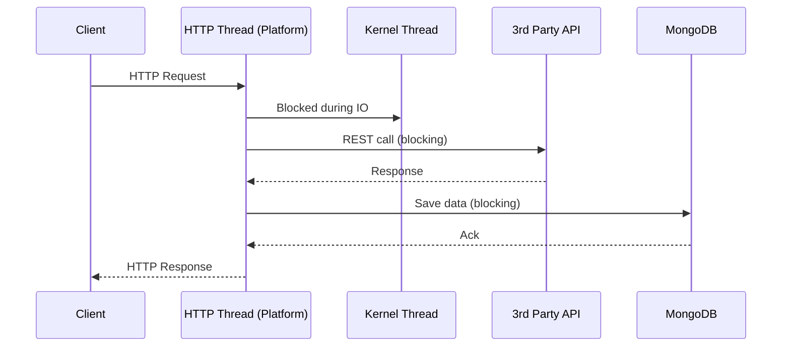
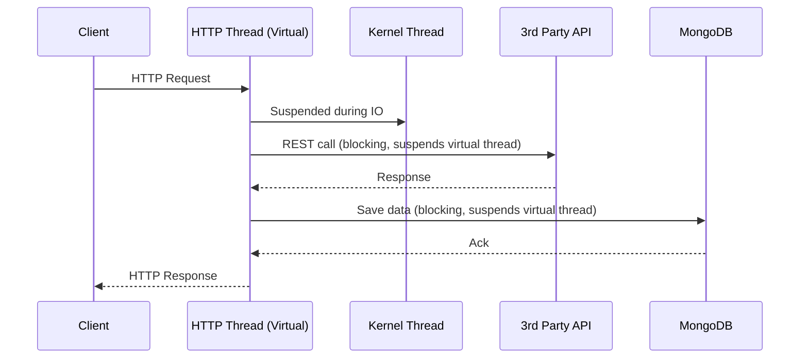
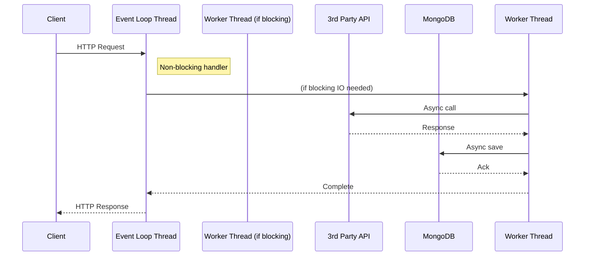
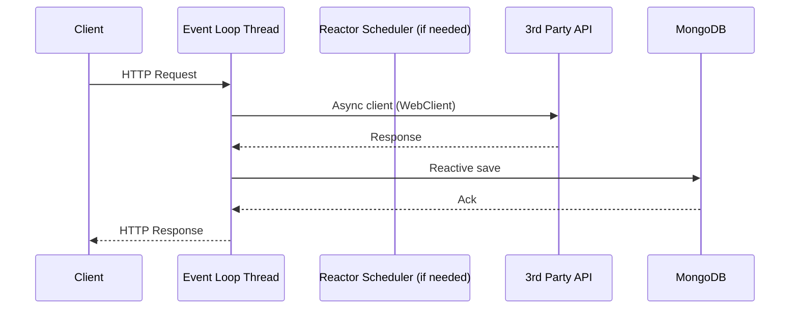
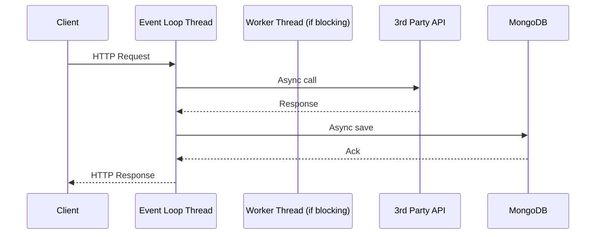
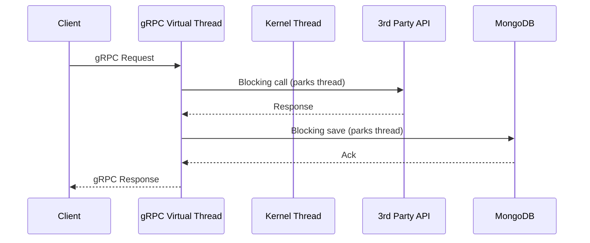
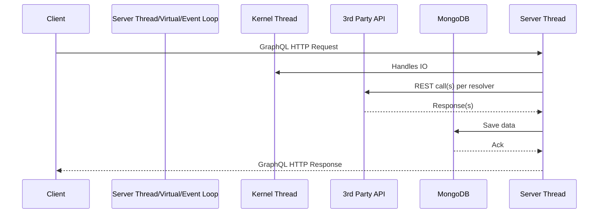

# A Deep Dive into Modern Java Server Models: MVC, Quarkus, Spring WebFlux, RESTEasy Reactive, Vert.x, gRPC, GraphQL, and Spring MVC with/without Virtual Threads

**Author:**  
**Target Audience:** Software Architects, Senior Developers

---

## Table of Contents

1. [Introduction](#introduction)
2. [Common Scenario and Constraints](#common-scenario-and-constraints)
3. [Section Structure](#section-structure)
4. [1. Spring MVC (Traditional & with Virtual Threads)](#spring-mvc)
5. [2. Quarkus (RESTEasy & RESTEasy Reactive)](#quarkus)
6. [3. Spring WebFlux](#spring-webflux)
7. [4. Vert.x](#vertx)
8. [5. Spring gRPC + Virtual Threads](#spring-grpc)
9. [6. GraphQL](#graphql)
10. [Performance Comparison Table (All Models, All Media Types)](#performance-comparison)
11. [Recommendation Matrix](#recommendation-matrix)
12. [Conclusion](#conclusion)
13. [References](#references)

---

## Introduction

Modern Java server-side technologies offer a spectrum of concurrency models, from classic thread-per-request to highly scalable event-loop and virtual thread architectures. This blog provides a deep technical analysis of popular frameworks, focusing on real-world, high-throughput, high-latency scenarios.

---

## Common Scenario and Constraints

- **Server hardware:** 1-core CPU, 4GB RAM per pod.
- **Traffic:** 4 billion requests/day (~46,296 requests/sec peak).
- **Each Request:**  
  - Calls a third-party API (10–60s latency).
  - Persists response to MongoDB.
- **Some APIs:** 10 million requests/day, event-driven streaming.
- **Thread memory footprint:** 1MB per thread.

---

## Section Structure

Each technology is analyzed using:

1. **Overview**
2. **Internal Execution Model**
   - Threading (platform threads, virtual threads, event loops)
   - Blocking/non-blocking IO
   - Request lifecycle
   - Sequence diagram (Mermaid)
3. **Resource Utilization**
   - CPU, memory, threads, connections
   - What happens during IO wait
4. **Kubernetes Sizing Calculation**
   - Replica count justification
5. **Performance with Media Types**
   - Table: Latency, resource usage, throughput for each media type
6. **Pros, Cons, Suitability**
7. **Best Use Cases**
8. **Summary Table**

---

## 1. Spring MVC (Traditional & with Virtual Threads) <a name="spring-mvc"></a>

### 1.1 Overview

- **Spring MVC (traditional):** Thread-per-request model using platform threads.
- **Spring MVC (virtual threads):** Similar, but leverages lightweight virtual threads (Project Loom).

### 1.2 Internal Execution Model

#### Threading Model

| Variant            | Thread Model          | IO Handling      |
|--------------------|----------------------|------------------|
| Traditional        | Platform (OS) thread | Blocking         |
| Virtual Threads    | Virtual thread       | Blocking (cheap) |

#### Blocking vs. Non-Blocking

- **Traditional:** Each HTTP request handled by a Tomcat/Jetty thread. During IO (e.g., third-party API, DB), thread blocks and is unavailable for other requests.
- **Virtual Threads:** Each request handled by a virtual thread. Blocking IO suspends the virtual thread, freeing up the underlying kernel thread.

#### Sequence Diagram (MVC Traditional)



#### Sequence Diagram (MVC with Virtual Threads)



- **Blocking points:** Third-party API call, MongoDB operation.
- **Kernel threads:** In traditional, kernel thread is blocked; in virtual threads, kernel thread is freed during blocking.

### 1.3 Resource Utilization

- **Traditional:**
  - 1MB per thread.
  - Max threads limited by RAM (4GB/1MB = ~4000 threads).
  - 4000 concurrent requests possible before exhaustion.
- **Virtual Threads:**
  - 1MB per virtual thread (heap; stack memory is minimal).
  - Can handle much higher concurrency (100k+), limited by heap and native memory for IO.
  - Kernel threads are reused and not blocked on IO.

#### What happens during IO?

- **Traditional:** Thread is blocked (cannot serve new requests).
- **Virtual:** Virtual thread is parked (does not consume kernel thread), kernel thread is used for other tasks.

### 1.4 Kubernetes Sizing Calculation

#### Calculating Required Threads

- 4B requests/day ≈ 46,296 requests/sec.
- If each request occupies a thread for avg 30s (IO-bound):
  - **Concurrent requests = 46,296 * 30 ≈ 1.4 million**
- RAM per pod: 4GB = 4096MB ⇒
  - Max platform threads/pod: 4096MB / 1MB = 4096
  - Max virtual threads/pod: Limited by heap, GC pressure, and OS file descriptors.

#### Required Pod Replicas

- **Traditional:**
  - 1 pod handles 4096 concurrent connections.
  - 1.4M / 4096 ≈ 342 pods (minimum, ignores overhead).
- **Virtual Threads:**
  - Can run 50,000–100,000 virtual threads safely (depends on garbage collection and heap pressure).
  - 1.4M / 100,000 ≈ 14 pods.

### 1.5 Media Type Performance

| Media Type                 | Serialization Perf | Memory | Latency | Supported |
|----------------------------|-------------------|--------|---------|-----------|
| JSON                       | High              | Low    | Low     | Yes       |
| XML                        | Medium            | Mid    | Mid     | Yes       |
| Protobuf                   | High              | Low    | Low     | Manual    |
| CBOR                       | High              | Low    | Low     | Manual    |
| GraphQL                    | Medium            | Mid    | Mid     | No        |
| NDJSON                     | High              | Low    | Low     | Yes       |
| PDF/Image/Multi-part       | High              | Mid    | Mid     | Yes       |
| YAML/Markdown/Atom/RSS     | Medium            | Mid    | Mid     | Yes/Manual|

### 1.6 Pros, Cons, Suitability

| Aspect           | Traditional MVC              | Virtual Threads MVC                    |
|------------------|-----------------------------|----------------------------------------|
| Simplicity       | High                        | High                                   |
| Concurrency      | Low                         | High                                   |
| Resource Usage   | High per request            | Low per request                        |
| Blocking IO      | Bad                         | Good (non-blocking to kernel thread)   |
| Debuggability    | High                        | High                                   |
| Suitability      | Low-latency, low-throughput | High-latency, high-throughput, legacy  |
| Streaming        | Yes                         | Yes                                    |

### 1.7 Best Use Cases

- **Traditional:** Simple apps, low concurrency, legacy code, no high-latency IO.
- **Virtual Threads:** Apps with high concurrency and blocking IO, easier migration for legacy code, no need to rewrite for async.

### 1.8 Summary Table

| Model            | Max Concurrency (4GB/pod) | Pods Needed (1.4M concurrency) | Good For                   |
|------------------|--------------------------|-------------------------------|----------------------------|
| MVC (Traditional)| ~4000                    | ~342                          | Simplicity, legacy         |
| MVC (Virtual)    | ~100,000                 | ~14                           | Blocking IO, migration     |

---

## 2. Quarkus (RESTEasy & RESTEasy Reactive) <a name="quarkus"></a>

### 2.1 Overview

- **RESTEasy (classic):** JAX-RS on top of servlet, thread-per-request.
- **RESTEasy Reactive:** Event-loop, non-blocking, built for reactive IO.

### 2.2 Internal Execution Model

#### Threading Model

| Variant            | Thread Model           | IO Handling      |
|--------------------|-----------------------|------------------|
| RESTEasy           | Platform thread        | Blocking         |
| RESTEasy Reactive  | Event loop + worker   | Non-blocking     |

#### Blocking vs. Non-Blocking

- **RESTEasy:** Same as Spring MVC traditional.
- **RESTEasy Reactive:** Uses event loop threads for HTTP, offloads blocking tasks to worker pool, IO is non-blocking.

#### Sequence Diagram (RESTEasy Reactive)



#### IO Wait Handling

- **Non-blocking:** Request is suspended, thread is available for new requests.

### 2.3 Resource Utilization

- **Event loops:** Small fixed thread pool (e.g., 2×CPU cores).
- **Worker pool:** Handles blocking code, size is configurable.
- **Memory:** Many concurrent requests, low per-request overhead.
- **Connections:** Optimized via NIO.

### 2.4 Kubernetes Sizing

- Event loops per pod: 1 core ⇒ 2 event loop threads.
- Worker pool for blocking tasks (sized for IO).
- Can handle 100k+ concurrent connections, limited by heap, file descriptors.

- 1.4M concurrency / 100k per pod ≈ 14 pods.

### 2.5 Media Type Performance

| Media Type       | RESTEasy Classic | RESTEasy Reactive |
|------------------|-----------------|-------------------|
| JSON             | Yes (good)      | Yes (good)        |
| Protobuf/CBOR    | Manual          | Manual            |
| NDJSON           | Yes             | Yes (efficient)   |
| Multipart/PDF    | Yes             | Yes               |
| GraphQL          | Via extension   | Via extension     |
| Others           | Yes/Manual      | Yes/Manual        |

### 2.6 Pros, Cons, Suitability

| Aspect           | RESTEasy         | RESTEasy Reactive             |
|------------------|-----------------|-------------------------------|
| Simplicity       | High             | Medium                        |
| Concurrency      | Low              | High                          |
| Non-blocking IO  | No               | Yes                           |
| Migration        | Easy from JAX-RS | Needs reactive rewrite        |
| Resource Usage   | High             | Low                           |
| Streaming        | Yes              | Yes (better)                  |

### 2.7 Best Use Cases

- **RESTEasy:** Migration from classic JAX-RS, simple apps.
- **RESTEasy Reactive:** High-concurrency, high-latency IO, streaming.

### 2.8 Summary Table

| Model                | Max Concurrency (4GB/pod) | Pods Needed | Good For                     |
|----------------------|--------------------------|-------------|------------------------------|
| RESTEasy             | ~4000                    | ~342        | Legacy JAX-RS                |
| RESTEasy Reactive    | ~100,000+                | ~14         | High concurrency, reactive IO|

---

## 3. Spring WebFlux <a name="spring-webflux"></a>

### 3.1 Overview

- Fully non-blocking, reactive framework based on Project Reactor.

### 3.2 Internal Execution Model

#### Threading Model

| Component         | Thread Model          | IO Handling           |
|-------------------|----------------------|-----------------------|
| Event Loop        | NIO (Netty/Servlet3) | Non-blocking          |
| Worker Pool       | Schedulers for heavy  | Non-blocking          |

#### Blocking vs. Non-Blocking

- **Handles requests on event loop threads.**
- **IO (3rd party, DB):** Uses reactive drivers, no thread is blocked; request is suspended as a state machine.

#### Sequence Diagram



- **Blocking:** None (unless you use blocking drivers, which breaks the model).

#### What happens during IO wait?

- **Request is suspended**; no thread is blocked. New requests can use the same threads.

### 3.3 Resource Utilization

- **Threads:** 2×CPU cores (event loops) + small worker pool.
- **Memory:** Only active state machines in memory, not stacks.
- **Concurrency:** 100k+ per pod possible.

### 3.4 Kubernetes Sizing

- Similar to Quarkus RESTEasy Reactive.
- 1.4M / 100k = ~14 pods.

### 3.5 Media Type Performance

| Media Type       | Supported | Performance        |
|------------------|-----------|-------------------|
| JSON             | Yes       | High              |
| Protobuf         | Yes       | High              |
| CBOR             | Yes       | High              |
| NDJSON           | Yes       | High              |
| Multipart        | Yes       | High (streaming)  |
| GraphQL          | Extension | Native via Spring  |
| PDF/Image        | Yes       | High              |
| YAML/Markdown    | Yes       | High              |

### 3.6 Pros, Cons, Suitability

| Aspect          | Value                                 |
|-----------------|---------------------------------------|
| Concurrency     | Extremely high                        |
| Debugging       | Harder than blocking                  |
| Resource usage  | Excellent for IO-bound                |
| CPU-bound       | Not optimal                           |
| Migration       | Requires rewrite                      |
| Streaming       | Best-in-class                         |

### 3.7 Best Use Cases

- High-concurrency, high-latency IO, streaming APIs, websockets.

### 3.8 Summary Table

| Model         | Max Concurrency | Pods Needed | Good For                |
|---------------|-----------------|-------------|-------------------------|
| WebFlux       | ~100,000+       | ~14         | High-latency IO, streams|

---

## 4. Vert.x <a name="vertx"></a>

### 4.1 Overview

- Event-driven, polyglot, non-blocking toolkit for reactive applications.

### 4.2 Internal Execution Model

#### Threading Model

| Component       | Thread Model | IO Handling     |
|-----------------|-------------|-----------------|
| Event Loop      | NIO         | Non-blocking    |
| Worker Pool     | For blocking ops | Blocking    |

#### Blocking vs. Non-Blocking

- **Event loops** handle all requests. Blocking ops are moved to worker pool.
- **Reactive drivers:** No threads blocked (except for legacy libraries).

#### Sequence Diagram



- **If blocking call:** Event loop delegates to worker thread.

#### What happens during IO wait?

- **Request is suspended as a state machine**, thread is available for new work.

### 4.3 Resource Utilization

- **Threads:** Small, fixed event loop and worker pools.
- **Concurrency:** 100k+ per pod.
- **Memory:** Minimal, no stack per request.

### 4.4 Kubernetes Sizing

- 1.4M / 100k = ~14 pods.

### 4.5 Media Type Performance

| Media Type   | Supported | Performance        |
|--------------|-----------|-------------------|
| JSON         | Yes       | High              |
| Protobuf     | Yes       | High              |
| NDJSON       | Yes       | High              |
| Multipart    | Yes       | High (streaming)  |
| GraphQL      | Extension | High              |
| Others       | Yes       | High              |

### 4.6 Pros, Cons, Suitability

| Aspect        | Value                    |
|---------------|-------------------------|
| Concurrency   | Extremely high           |
| Resource usage| Excellent                |
| Debugging     | Harder than blocking     |
| Streaming     | Excellent                |
| Migration     | Needs rewrite            |

### 4.7 Best Use Cases

- High-concurrency, microservices, event-driven, real-time, streaming.

### 4.8 Summary Table

| Model   | Max Concurrency | Pods Needed | Good For               |
|---------|-----------------|-------------|------------------------|
| Vert.x  | ~100,000+       | ~14         | Reactive, streaming    |

---

## 5. Spring gRPC + Virtual Threads <a name="spring-grpc"></a>

### 5.1 Overview

- Combines high-performance binary gRPC transport with lightweight virtual threads.

### 5.2 Internal Execution Model

#### Threading Model

| Component      | Thread Model      | IO Handling   |
|----------------|------------------|---------------|
| gRPC Server    | Virtual thread    | Blocking (cheap) |

#### Blocking vs. Non-Blocking

- Each gRPC call handled by a virtual thread.
- Blocking IO (e.g., 3rd-party call, MongoDB) suspends virtual thread, kernel thread is free.

#### Sequence Diagram



### 5.3 Resource Utilization

- **Threads:** 1MB per virtual thread, but thousands can coexist.
- **Concurrency:** 100k+ per pod possible.
- **Binary encoding (protobuf):** Low memory, high throughput.

### 5.4 Kubernetes Sizing

- 1.4M / 100k = ~14 pods.

### 5.5 Media Type Performance

| Media Type   | Supported | Performance |
|--------------|-----------|-------------|
| Protobuf     | Yes       | Highest     |
| JSON         | Manual    | High        |
| Multipart    | Manual    | High        |
| GraphQL      | No        | N/A         |
| Others       | No        | N/A         |

### 5.6 Pros, Cons, Suitability

| Aspect        | Value                    |
|---------------|-------------------------|
| Concurrency   | Extremely high           |
| Resource usage| Excellent                |
| Streaming     | Native (gRPC streams)    |
| Debugging     | Good (virtual threads)   |
| Media Types   | Binary-focused           |

### 5.7 Best Use Cases

- Internal APIs, microservices, high-throughput, binary data, streaming.

### 5.8 Summary Table

| Model           | Max Concurrency | Pods Needed | Good For                 |
|-----------------|-----------------|-------------|--------------------------|
| gRPC + vThreads | ~100,000+       | ~14         | Internal, binary, streaming|

---

## 6. GraphQL <a name="graphql"></a>

### 6.1 Overview

- Query language/API runtime. Can be implemented over any concurrency model.

### 6.2 Internal Execution Model

- **Depends on backing server (MVC, WebFlux, Vert.x)**
- Typically: Each query is parsed, validated, and executed (can be serial or parallel execution of resolvers).

#### Sequence Diagram



### 6.3 Resource Utilization

- **Depends on engine (blocking vs. async)**
- **Concurrency:** Same as underlying server.

### 6.4 Kubernetes Sizing

- Same as underlying server.

### 6.5 Media Type Performance

| Media Type   | Supported | Performance        |
|--------------|-----------|-------------------|
| JSON         | Yes       | High              |
| GraphQL      | Yes       | High              |
| Multipart    | Yes       | High              |
| Protobuf     | No        | N/A               |
| Others       | No        | N/A               |

### 6.6 Pros, Cons, Suitability

| Aspect        | Value                    |
|---------------|-------------------------|
| Concurrency   | As per server            |
| Streaming     | Supported (subscriptions)|
| Resource usage| As per server            |
| Media Types   | Focused on JSON          |

### 6.7 Best Use Cases

- APIs with complex querying needs, mobile clients, data aggregation.

### 6.8 Summary Table

| Engine           | Max Concurrency | Pods Needed | Good For         |
|------------------|-----------------|-------------|------------------|
| GraphQL on WebFlux| ~100k+         | ~14         | Aggregation, APIs|

---

## 7. Performance Comparison Table (All Models, All Media Types) <a name="performance-comparison"></a>

| Model                 | JSON | XML | Protobuf | CBOR | NDJSON | PDF/Image | Multipart | GraphQL | Streaming | Max Concurrency | Pods Needed |
|-----------------------|------|-----|----------|------|--------|-----------|-----------|---------|-----------|-----------------|-------------|
| MVC (Traditional)     | H    | M   | M*       | M*   | H      | M         | H         | N       | Y         | ~4,000          | ~342        |
| MVC (Virtual)         | H    | M   | M*       | M*   | H      | M         | H         | N       | Y         | ~100,000        | ~14         |
| RESTEasy              | H    | M   | M*       | M*   | H      | H         | H         | N       | Y         | ~4,000          | ~342        |
| RESTEasy Reactive     | H    | M   | M*       | M*   | H      | H         | H         | E       | Y         | ~100,000        | ~14         |
| WebFlux               | H    | M   | H        | H    | H      | H         | H         | E       | Y         | ~100,000        | ~14         |
| Vert.x                | H    | M   | H        | H    | H      | H         | H         | E       | Y         | ~100,000        | ~14         |
| gRPC + vThreads       | M*   | N   | H        | M*   | N      | N         | N         | N       | Y         | ~100,000        | ~14         |
| GraphQL/WebFlux       | H    | N   | N        | N    | N      | N         | Y         | H       | Y         | ~100,000        | ~14         |

- H: High, M: Medium, N: Not supported, E: Extension, M*: Manual integration

---

## 8. Recommendation Matrix <a name="recommendation-matrix"></a>

| Load      | Latency | Streaming | Media Type      | Best Model(s)         | Notes                                    |
|-----------|---------|-----------|-----------------|-----------------------|------------------------------------------|
| Low       | Low     | No        | Any             | MVC (Traditional)     | Simplicity wins                          |
| High      | High    | No        | JSON/Proto/CBOR | WebFlux, Vert.x, Quarkus RESTEasy Reactive, MVC (Virtual), gRPC + vThreads | For high-latency IO, non-blocking or virtual threads are best |
| High      | High    | Yes       | NDJSON, Proto   | WebFlux, Vert.x, gRPC | Streaming support is critical            |
| High      | Low     | No        | JSON            | Any                   | All perform well                         |
| High      | Low     | No        | Binary (Proto)  | gRPC + vThreads       | gRPC shines for binary transport         |
| Moderate  | High    | No        | XML/YAML        | MVC (Virtual), RESTEasy| Manual tuning needed                     |
| High      | High    | Yes       | GraphQL         | GraphQL on WebFlux    | Only if GraphQL needed                   |
| High      | High    | No        | Images/PDF      | WebFlux, Vert.x       | Non-blocking IO helps                    |

---

## 9. Conclusion <a name="conclusion"></a>

- **Platform threads (classic MVC, RESTEasy):** Hit concurrency/resource wall in high-latency, high-load scenarios.
- **Virtual threads:** Game-changer for legacy code, high-latency IO, easy migration, thread-per-request model scales.
- **Reactive/event loop (WebFlux, Vert.x, RESTEasy Reactive):** Best for ultra-high concurrency, streaming, efficient resource usage. Requires non-blocking drivers and reactive code.
- **gRPC + virtual threads:** Excels for binary, internal APIs, streaming.
- **GraphQL:** Best for aggregation, when flexible queries are needed, ideally on top of a reactive/virtual-thread server.

**General Guidance:**

- **Blocking IO, legacy code:** Use virtual threads.
- **High-latency IO, new code:** Use reactive/event loop.
- **Binary, streaming, microservices:** Use gRPC + virtual threads.
- **Complex querying:** Use GraphQL on top of reactive/virtual-thread model.

---

## 10. References <a name="references"></a>

- [Project Loom: Virtual Threads](https://openjdk.org/projects/loom/)
- [Spring WebFlux Docs](https://docs.spring.io/spring-framework/docs/current/reference/html/web-reactive.html)
- [Vert.x Documentation](https://vertx.io/docs/)
- [Quarkus RESTEasy Reactive](https://quarkus.io/guides/resteasy-reactive)
- [gRPC Java](https://grpc.io/docs/languages/java/)
- [GraphQL Java](https://www.graphql-java.com/)
- ["Thread per request" vs "Event loop" models](https://www.infoq.com/articles/java-virtual-threads/)

---

```
**Notes:**
- For diagrams, use Mermaid or PlantUML in markdown-supporting blog engines.
- For in-depth JVM memory/thread management, consult JVM tuning guides.
- Sizing calculations are simplified for illustration; real-world deployments need resilience, monitoring, and headroom.
