# Grafana Provisioning

## Overview

This directory contains **provisioning files** for [Grafana](https://grafana.com/docs/grafana/latest/administration/provisioning/), enabling automated setup of datasources and dashboards for observability and monitoring.

- `datasources/datasource.yaml` – Declares one or more data sources (e.g., Prometheus).
- `dashboards/dashboard.yaml` – Configures a dashboard provider to auto-load dashboards from a directory.

---

## How and When to Use

### When to Use

- **Automated Grafana Setup:**  
  Use provisioning files to avoid manually configuring datasources/dashboards via the GUI, especially in CI/CD, Docker, or Kubernetes environments.
- **Version-Controlled Observability:**  
  Store and track monitoring configuration in Git alongside your code.
- **Consistent Environments:**  
  Ensure test, staging, and production environments are monitored in the same way.

### How to Use

1. **Mount into Docker or Kubernetes:**
   - Place these files in your project and mount under `/etc/grafana/provisioning` in the Grafana container.
   - Example Docker Compose service:
     ```yaml
     grafana:
       image: grafana/grafana:latest
       volumes:
         - ./grafana-provisioning/datasources:/etc/grafana/provisioning/datasources
         - ./grafana-provisioning/dashboards:/etc/grafana/provisioning/dashboards
         - ./grafana-provisioning/my-dashboards:/etc/grafana/provisioning/dashboards
     ```
2. **Add Custom Dashboards:**
   - Place exported dashboard JSON files in the directory specified in `dashboard.yaml` (default: `/etc/grafana/provisioning/dashboards`).

---

## Limitations

- **Initial Configuration Only:**  
  Provisioned datasources/dashboards are set at startup. Later GUI changes may not persist or may be overwritten.
- **Manual Dashboard Export:**  
  Export dashboards from the Grafana UI as JSON and add them to the provisioned directory.
- **Secrets:**  
  Do **not** store API keys or passwords in plain text here if this repo is public.
- **Community:**  
  The Grafana ecosystem is large and active, but dashboard JSON formats can change with upgrades.

---

## Future Scope

- **Templated Dashboards:**  
  Use environment variables, Jsonnet, or Grafonnet for DRY/configurable dashboards.
- **Automated Export:**  
  Scripts or CI pipelines can export, validate, and update dashboards automatically.
- **Org-wide Standards:**  
  Standardize monitoring across teams and environments with versioned provisioning.

---

## Sequence Diagram

```mermaid
sequenceDiagram
    participant DevOps as DevOps Engineer
    participant Git as Git Repo
    participant CI as CI/CD
    participant Grafana as Grafana Server

    DevOps->>Git: Commit provisioning files
    CI->>Grafana: Deploy files via volume mount or ConfigMap
    Grafana->>Grafana: Loads datasources and dashboards at startup
    DevOps->>Grafana: Accesses pre-provisioned dashboards
```



---

## Summary

Provisioning allows you to automate and version-control your Grafana observability stack, ensuring consistency, repeatability, and rapid onboarding for new environments.

---