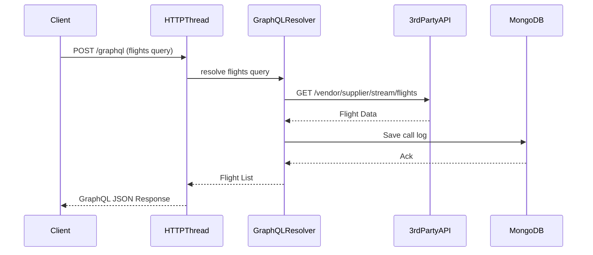

# GraphQL Module

## Overview

This module demonstrates a Spring Boot application exposing a **GraphQL API** for querying flight data.

- GraphQL endpoint: `/graphql` (POST queries).
- Exposes the `flights` query, returning a list of flights (see schema).
- Flight data is fetched from a third-party REST API and every API call/response is logged to MongoDB (`calls_log` collection).
- Schema is defined in [`src/main/resources/graphql/flight.graphqls`](src/main/resources/graphql/flight.graphqls).

## Internal Execution Model

- The main HTTP request is handled via the Servlet API (thread-per-request).
- GraphQL query is parsed and resolved; the Java service layer calls the third-party REST API (blocking), then logs the result to MongoDB.
- The result is returned as a structured, typed GraphQL response.

---

## Sequence Diagram



---

## How and When to Use

### When to Use

- **Flexible, Client-driven APIs:**  
  When consumers (web/mobile) want to select and shape only the data they need, reducing over-fetching.
- **Aggregating Multiple Backends:**  
  When combining data from several sources into a unified API.
- **Rapid Prototyping & Evolution:**  
  When API evolution (adding fields, types) must be fast and non-breaking.
- **Complex Queries:**  
  When clients need to fetch deep or nested data in a single request.

### How to Use

- Build and run the Docker image, ensuring MongoDB is available.
- Use a GraphQL client (GraphQL Playground, Postman, Insomnia, etc.) to query `/graphql`:
    ```
    query {
      flights {
        flightNumber
        from
        to
        price
        airline { name }
      }
    }
    ```

---

## Limitations

### Technical

- **Blocking IO:**  
  This implementation uses blocking REST calls and MongoDB drivers (adapt for reactive if needed). High-concurrency workloads may require more resources.
- **HTTP/1.1 Only:**  
  Standard GraphQL over HTTP, not optimized for streaming or subscriptions out-of-the-box.
- **Batching & N+1:**  
  Care is needed in resolvers to avoid N+1 queries for complex schemas.
- **API Complexity:**  
  GraphQL is more complex to learn, and error handling is more nuanced than REST.
- **Lack of Native Caching:**  
  Caching strategies are not built-in and must be designed for your use case.

### Community & Ecosystem

- **Strong and Growing:**  
  GraphQL has a large and vibrant ecosystem, with extensive tooling and documentation.
- **Interoperability:**  
  Many clients and libraries in multiple languages, but not as universal as REST.

---

## Future Scope for Organizations

- **API Gateway:**  
  GraphQL is an ideal gateway for BFF (Backend-for-Frontend) and micro-frontend architectures.
- **Subscriptions & Live Queries:**  
  For real-time needs, can add GraphQL subscriptions (WebSocket-based).
- **Federation:**  
  Enables joining multiple microservices into a single API.
- **Skill Investment:**  
  Teams should train in schema design, query optimization, and GraphQL security best practices.

---

## Summary

Spring Boot + GraphQL is ideal for **flexible, client-driven, and rapidly evolving APIs** where consumers need tailored data access.  
For high-concurrency, streaming, or binary needs, consider reactive or gRPC-based modules in this project.

---