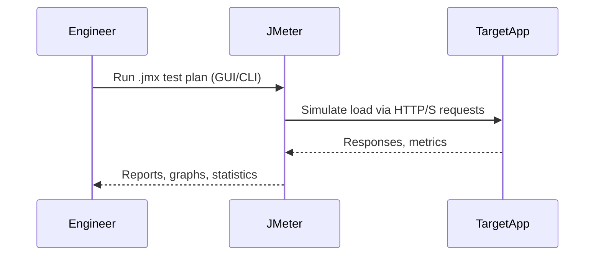

# JMeter Load Test Stub Module

## Overview

This module is a **stub and template** for integrating [Apache JMeter](https://jmeter.apache.org/) load testing into your system.

- Place your `.jmx` test plans (see `src/main/resources/example-loadtest.jmx`) and run them via the JMeter GUI or CLI.
- Optionally, you may integrate JMeter programmatically in Java (see [JMeter API docs](https://jmeter.apache.org/api/)).

---

## Sequence Diagram



---

## How and When to Use

### When to Use

- **Performance and Load Testing:**  
  When you want to simulate real-world traffic and measure system throughput, latency, and stability under load.
- **Regression and Stress Testing:**  
  To verify service performance with each release or under extreme conditions.
- **API and Web Testing:**  
  JMeter supports HTTP, WebSockets, JDBC, JMS, FTP, and more.

### How to Use

- Edit or create `.jmx` test plans in the JMeter GUI or by hand.
- Run with JMeter CLI:  
  ```
  jmeter -n -t src/main/resources/example-loadtest.jmx -l results.jtl
  ```
- Analyze results with JMeter GUI, CLI, or plugins for advanced reports.

---

## Limitations

### Technical

- **Not a Java microservice:**  
  JMeter is a Java application, not a library you embed in production code.
- **Limited programmatic API:**  
  While possible, running JMeter from Java code is rarely done in practice.
- **Heavyweight for CI:**  
  JMeter runs can be resource-intensive; lightweight tools may be better for "smoke" or "unit" performance tests.

### Community & Ecosystem

- **Very mature:**  
  JMeter is an industry standard with a massive ecosystem and plugin library.
- **Best for HTTP/REST, not for all protocols:**  
  While extensible, some modern protocols (gRPC, GraphQL) may need additional plugins or scripting.

---

## Future Scope for Organizations

- **CI/CD Integration:**  
  Integrate JMeter runs in Jenkins, GitHub Actions, or other CI/CD pipelines for automated performance validation.
- **Distributed Testing:**  
  JMeter supports distributed (multi-machine) load generation for very high scale.
- **Skill Investment:**  
  Teams should learn JMeter GUI, test plan design, and result interpretation for maximum benefit.

---

## Summary

JMeter is a best-in-class tool for **performance, load, and stress testing** all types of web services and APIs.  
Use this module as a template for test plan storage, versioning, and (optionally) as a wrapper for programmatic execution.

---