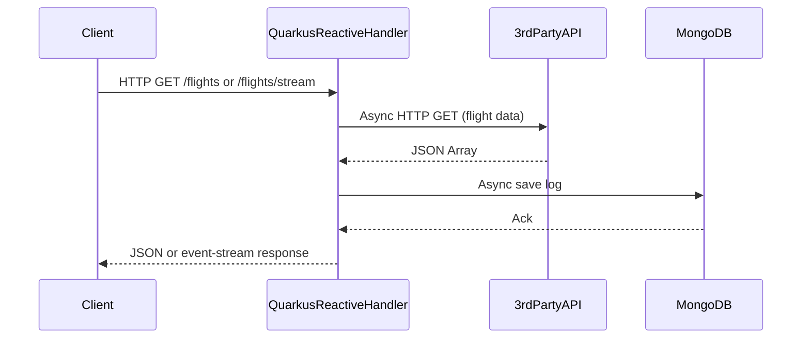

# Quarkus RESTEasy Reactive Application

## Overview

This module is a **production-ready Quarkus RESTEasy Reactive application**.  
It demonstrates a modern, non-blocking, cloud-native Java microservice using REST API endpoints and MongoDB logging.

- `GET /flights`  
  Returns a JSON array of flights (fetched from a third-party API, non-blocking).
- `GET /flights/stream`  
  Streams the same flight data as Server-Sent Events (`text/event-stream`).
- Each API call and response is logged as a document in MongoDB (`calls_log` collection).

---

## Internal Execution Model

- **Built on Quarkus RESTEasy Reactive:**  
  Non-blocking, event-driven, and optimized for high concurrency and cloud deployments.
- **Mutiny/Uni:**  
  Uses the Mutiny library for asynchronous programming.
- **Reactive MongoDB:**  
  Uses Quarkus' reactive MongoDB client.
- **Native & Cloud-Ready:**  
  Fast startup, low memory, ready for Kubernetes and serverless.

---

## Sequence Diagram

---

## How and When to Use

### When to Use

- **High concurrency, event-driven services:**  
  When you need to handle thousands of concurrent, IO-bound requests with low latency.
- **Streaming and reactive APIs:**  
  For streaming, event-driven, or real-time APIs (SSE, WebSockets).
- **Cloud Native and Native Images:**  
  For microservices that need fast startup, low memory, and Kubernetes/serverless deployment.
- **Full reactive stack:**  
  When you want to avoid blocking IO and maximize hardware efficiency.

### How to Use

- Build: `mvn clean package`
- Run: `java -jar target/quarkus-app/quarkus-run.jar`
- Or build/run as native: `mvn package -Pnative`
- Access:
  - `GET http://localhost:8080/flights`
  - `GET http://localhost:8080/flights/stream`
- Configure MongoDB in `src/main/resources/application.properties` if needed.

---

## Limitations

### Technical

- **Learning Curve:**  
  Reactive programming (Mutiny/Uni, non-blocking paradigms) can be unfamiliar to some teams.
- **Blocking code is dangerous:**  
  Avoid blocking operations in the reactive flow—they will undermine concurrency and scalability.
- **Tooling:**  
  Some debugging and profiling tools may not yet fully support reactive stacks.
- **Not a drop-in replacement for imperative code:**  
  Requires careful design and testing.

### Community & Ecosystem

- **Rapidly Growing:**  
  Quarkus RESTEasy Reactive is gaining adoption, with strong community and Red Hat support.
- **Smaller than Spring:**  
  Still building out its ecosystem, but rapidly maturing.

---

## Future Scope for Organizations

- **Modernization:**  
  Ideal for organizations adopting Kubernetes, serverless, or microservices architectures.
- **Performance:**  
  Ultra-fast startup and low memory usage, especially with native images.
- **Skill Growth:**  
  Teams should invest in learning reactive programming and Quarkus best practices.

---

## Summary

Quarkus RESTEasy Reactive is a top choice for cloud-native, event-driven Java microservices requiring high performance, concurrency, and resource efficiency.  
Use it to build scalable, modern REST APIs for the next generation of cloud deployments.

---