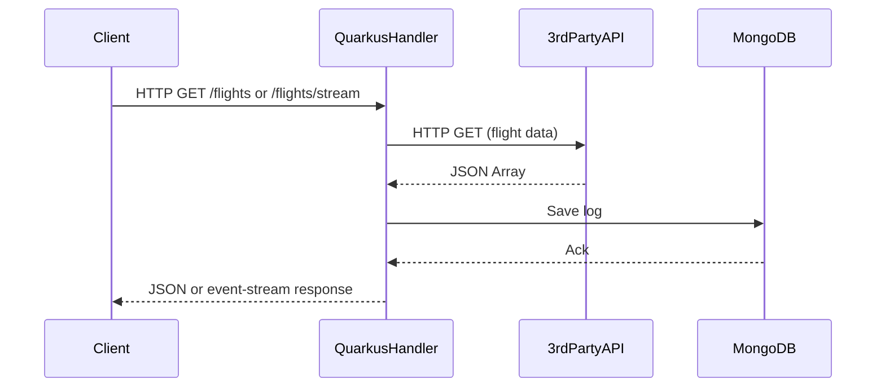

# Quarkus RESTEasy Application

## Overview

This module is a **production-ready Quarkus RESTEasy application**.  
It demonstrates modern, cloud-native Java microservice development with REST API endpoints and MongoDB logging.

- `GET /flights`  
  Returns a JSON array of flights (fetched from a third-party API).
- `GET /flights/stream`  
  Streams the same flight data as Server-Sent Events (`text/event-stream`).
- Each API call and response is logged as a document in MongoDB (`calls_log` collection).

---

## Internal Execution Model

- **Built on Quarkus:**  
  Fast startup, low memory, container- and Kubernetes-ready.
- **RESTEasy/JAX-RS:**  
  Standard REST endpoints and SSE support.
- **Non-blocking HTTP client:**  
  Uses Java 11+ HttpClient (can be replaced by Vert.x or RESTEasy Reactive for full non-blocking stack).
- **MongoDB Client:**  
  Native Quarkus MongoDB integration.

---

## Sequence Diagram

---

## How and When to Use

### When to Use

- **Cloud Native & Containerized:**  
  When you need ultra-fast boot, low memory, and optimized performance for microservices in Kubernetes or serverless environments.
- **REST APIs & Microservices:**  
  Ideal for REST APIs, event-driven apps, and microservices that need to scale efficiently.
- **Native Compilation:**  
  Compile to a native binary via GraalVM for serverless or cold-start-sensitive platforms.

### How to Use

- Build: `mvn clean package`
- Run: `java -jar target/quarkus-app/quarkus-run.jar`
- Or build/run as native: `mvn package -Pnative`
- Access endpoints:
  - `GET http://localhost:8080/flights`
  - `GET http://localhost:8080/flights/stream`
- Configure MongoDB in `src/main/resources/application.properties` if needed.

---

## Limitations

### Technical

- **Blocking HTTP client:**  
  The Java HttpClient used here is blocking. For full non-blocking, use Quarkus RESTEasy Reactive or Vert.x Web Client.
- **No Spring Boot features:**  
  Quarkus uses CDI and its own extension ecosystem.
- **Learning Curve:**  
  Developers must learn Quarkus configuration, CDI, and differences from Spring Boot.
- **Native Image Limitations:**  
  Some Java libraries may not be compatible with native compilation.

### Community & Ecosystem

- **Rapidly Growing:**  
  Strong Red Hat and community support, growing ecosystem for extensions and integrations.
- **Not yet as wide as Spring Boot:**  
  Fewer legacy constraints, but less reference code in some enterprise sectors.

---

## Future Scope for Organizations

- **Modernization:**  
  Quarkus is ideal for organizations moving to Kubernetes, OpenShift, or serverless platforms.
- **Performance:**  
  Native images and fast JVM mode improve resource utilization and scalability.
- **Skill Growth:**  
  Teams should learn Quarkus’s dependency injection (CDI), configuration, and native-image tooling for future projects.

---

## Summary

Quarkus RESTEasy is a top choice for new, cloud-native Java microservices requiring fast startup, low memory, and native image support.  
Use it to build fast, efficient, and scalable REST APIs for the next generation of cloud-native Java deployments.

---