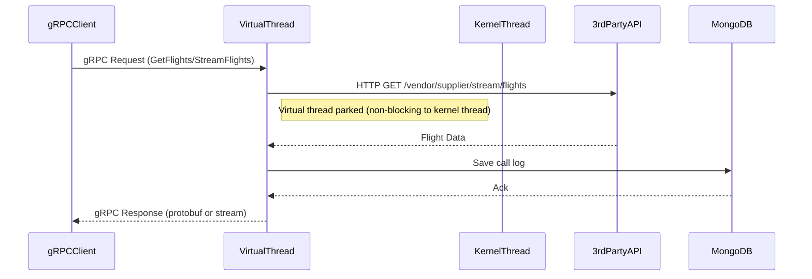

# Spring gRPC + Virtual Threads Module

## Overview

This module demonstrates a **high-performance, binary API** built with Spring Boot, gRPC, and Java 21+ virtual threads.  
It exposes:
- `FlightService/GetFlights`: Returns a list of flights (as protobuf binary message).
- `FlightService/StreamFlights`: Streams flight records over a single gRPC connection (highly efficient for large or live datasets).

The service implementation:
- Calls a third-party REST API to fetch flight data.
- Logs every API call and response into MongoDB (`calls_log` collection).

## Internal Execution Model

- Each gRPC call is handled on a **virtual thread** (Project Loom).
- Blocking IO (REST call, MongoDB save) only parks the virtual thread—not a platform thread—enabling huge scalability.
- gRPC uses HTTP/2 with multiplexed, persistent connections and efficient binary encoding (protobuf).

---

## Sequence Diagram

---

## How and When to Use

### When to Use

- **Binary API for Internal Services:**  
  When you need high-performance, contract-first, binary APIs between microservices.
- **High Concurrency, IO-bound Workloads:**  
  When thousands or more concurrent, slow requests must be supported with minimal hardware.
- **Streaming or Real-Time Feeds:**  
  For data that needs to be streamed (live telemetry, event logs, etc.).
- **Easy Migration Path:**  
  For teams with existing blocking Java codebases wanting to scale up concurrency easily (with Java 21+).

### How to Use

- Build and run the Docker image (Java 21+), ensuring MongoDB is reachable.
- Use a gRPC client (e.g., grpcurl, Postman, or codegen clients) to call `GetFlights` and `StreamFlights`.
- Monitor metrics via the Prometheus `/actuator/prometheus` endpoint.

---

## Limitations

### Technical

- **Not for Browsers:**  
  gRPC is not natively supported by browsers (except via gRPC-Web or proxies).
- **Protobuf Schema Management:**  
  Requires strictly managed protobuf `.proto` schemas for all endpoints.
- **Blocking Library Caution:**  
  While virtual threads scale blocking code, libraries that use native threads internally may still be limiting.
- **Debugging and Tooling:**  
  Virtual threads are new; some profilers and APM tools may not fully support them.
- **Client Ecosystem:**  
  gRPC clients are available in most languages, but not as universal as HTTP/REST.

### Community & Ecosystem

- **gRPC:**  
  Highly popular for internal microservices (Google, Netflix, etc.), with strong Java support and open-source backing.
- **Virtual Threads:**  
  Rapidly growing, but newer than traditional thread models. Community support and documentation expanding.
- **Production References:**  
  Several large-scale Java shops have adopted virtual threads for IO-bound services, but fewer public references than for REST.

---

## Future Scope for Organizations

- **Cloud Native and High-Throughput:**  
  Perfect fit for internal APIs in high-scale, cloud-native architectures.
- **Safe for Migration:**  
  Allows migration of blocking code to high-concurrency scenarios with minimal rewrite.
- **Preparation for Future Java:**  
  Investing in virtual threads is future-proofing for ongoing JVM improvements.
- **Skill Growth:**  
  Teams should get comfortable with protobuf, contract-first API design, and monitoring virtual-threaded services.

---

## Summary

Spring Boot + gRPC + virtual threads is **ideal for high-throughput, binary, streaming, or internal APIs** where performance and resource efficiency are critical, and blocking IO is unavoidable or legacy code must be reused with minimal changes.  
For public APIs or browser clients, consider REST/JSON or GraphQL alternatives.

---