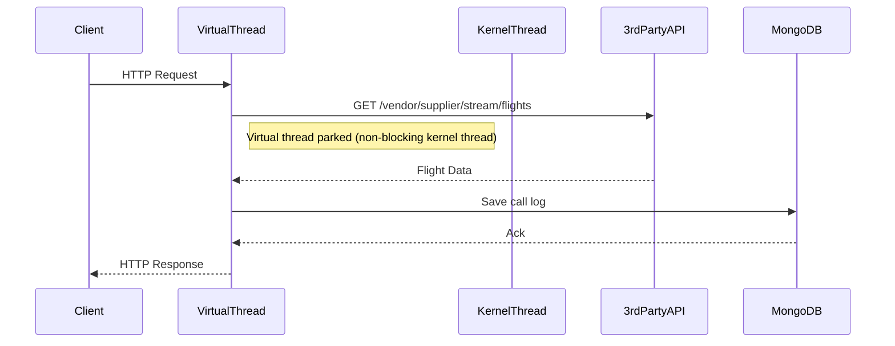

# Spring MVC with Virtual Threads

## Overview

This module demonstrates a modern approach to Spring Boot MVC using Java 21+ **virtual threads**. It exposes:
- `GET /flights`: Returns a list of flight objects as JSON.
- `GET /flights/stream`: Streams the data as Server-Sent Events (`text/event-stream`).

The service layer:
- Calls a third-party API to fetch flight data.
- Logs every API call and response into MongoDB (`calls_log` collection).

## Internal Execution Model

- **Virtual threads** (Project Loom) allow each HTTP request to be handled by a lightweight user-mode thread, not a heavyweight OS thread.
- Blocking IO (e.g., waiting for third-party API or MongoDB) parks the virtual thread, but does **not** block a kernel thread, allowing massive concurrency.

## Sequence Diagram

- **Blocking points** (API call, MongoDB) only park the virtual thread, not a kernel thread.

## How and When to Use

### When to Use

- **High Concurrency with Simplicity:**  
  When you need to serve thousands to hundreds of thousands of concurrent requests, especially IO-bound, with a familiar imperative programming model.
- **Migration Path:**  
  When you want to migrate a traditional Spring MVC codebase to scale for high-latency workloads without rewriting for reactive APIs.
- **Modern JVM (Java 21+):**  
  When your environment supports Java 21+ and you want to leverage the latest JVM features.

### How to Use

- Build and run the Docker image (Java 21+), ensuring MongoDB is available (see parent `docker-compose.yml`).
- Access `/flights` for JSON, `/flights/stream` for SSE.

## Limitations

### Technical

- **Requires Java 21+ and Spring Boot 3.2+:**  
  Virtual threads are a new feature; your environment and dependencies must support them.
- **Blocking APIs Still Block Resources:**  
  If library code uses native threads internally, you may still hit scalability limits.
- **SSE/Streaming:**  
  Each SSE connection is still a virtual thread; while cheap, millions of connections may hit heap or FD limits.
- **Debugging/Profiling:**  
  Some profilers and monitoring tools may not fully support virtual thread semantics yet.

### Community & Ecosystem

- **Rapidly Growing, but New:**  
  Community support and documentation are growing, but not as mature as classic Spring MVC or WebFlux.
- **Third-Party Libraries:**  
  Some libraries may not yet be tested or optimized for virtual threads.
- **Example/Reference Apps:**  
  Fewer production examples compared to traditional MVC or WebFlux (as of 2024–2025).

## Future Scope for Organizations

- **Sustainable Migration:**  
  Easy path for scaling existing blocking code without deep refactors to reactive.
- **Cloud Native Ready:**  
  Enables classic Spring MVC apps to handle cloud-scale workloads, especially IO-heavy APIs or aggregators.
- **Team Skills:**  
  Teams can continue to use imperative code, while gaining scalability benefits.
- **Stay Updated:**  
  Keep track of JVM, Spring, and library support for virtual threads for best results.

## Summary

Spring MVC with virtual threads is ideal for teams wanting to scale IO-bound workloads with minimal code changes, leveraging modern JVMs. For the highest throughput, especially with non-blocking drivers, consider WebFlux or event-loop models, but for most enterprise APIs, virtual threads are a game-changer.

---