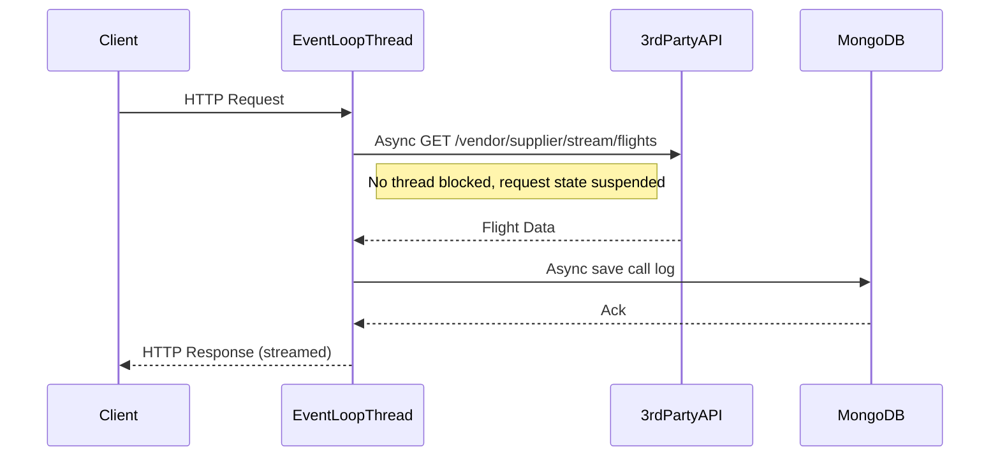

# Spring WebFlux Module

## Overview

This module demonstrates a **fully reactive** Spring Boot application using Spring WebFlux (based on Project Reactor).  
It exposes:
- `GET /flights`: Returns a list of flights as a Flux (reactive stream, serialized as JSON array).
- `GET /flights/stream`: Streams the same data as Server-Sent Events (`text/event-stream`), optimized for high-concurrency and streaming use-cases.

The service layer:
- Calls a third-party API via a non-blocking WebClient.
- Logs every API call and response into MongoDB (`calls_log` collection) using reactive, non-blocking drivers.

## Internal Execution Model

- Uses a small number of event-loop threads (based on Netty or Servlet 3.1+).
- Each request is handled as a state machine (not tied to a thread).
- Network and database IO are non-blocking; threads are never blocked waiting for IO.
- Suitable for **huge concurrency** (tens or hundreds of thousands of simultaneous requests) on limited hardware.

## Sequence Diagram

- **No blocking points:** All IO is non-blocking, threads are always available for new work.

## How and When to Use

### When to Use

- **High Concurrency, IO-bound Workloads:**  
  When your service must handle thousands to millions of slow, IO-bound requests concurrently (API gateway, aggregator, streaming, chat, etc.).
- **Server-Sent Events or Streaming:**  
  When you need to serve data as a continuous or periodic stream (SSE, WebSockets).
- **Cloud-Native, Resource-Efficient:**  
  When you need to maximize performance per hardware resource in Kubernetes, cloud, or microservices environments.
- **API Gateway & Aggregators:**  
  For APIs that aggregate multiple slow third-party calls.

### How to Use

- Build and run the Docker image, ensuring MongoDB is available (see parent `docker-compose.yml`).
- Access `/flights` for JSON (reactive array), `/flights/stream` for real-time SSE.

## Limitations

### Technical

- **Learning Curve:**  
  Reactive programming is a paradigm shift from imperative code. Requires understanding of Reactor (`Flux`/`Mono`), backpressure, and async error handling.
- **Debugging & Profiling:**  
  Stack traces and flow are less intuitive than traditional thread-per-request models.
- **Blocking Calls are Dangerous:**  
  Introducing blocking code (e.g., JDBC, legacy libraries) in the reactive path can block event-loop threads and kill performance.
- **Third-Party Library Support:**  
  All external calls (DB, HTTP, etc.) must be non-blocking/reactive for full benefit.

### Community & Ecosystem

- **Growing and Modern:**  
  Large support in the Spring ecosystem (Spring Cloud Gateway, RSocket, etc.), but fewer production examples than classic MVC.
- **Adoption:**  
  Becoming the standard for new, high-scale Java APIs and microservices.

## Future Scope for Organizations

- **Best for Cloud Native:**  
  Highly recommended for new greenfield projects requiring high scalability and efficiency.
- **Ready for Streaming and Real-Time:**  
  Excellent for event streams, SSE, WebSockets, and integration with modern data platforms.
- **Skill Investment:**  
  Teams should invest in learning reactive programming to leverage full benefits.
- **Migration:**  
  Existing imperative codebases require significant refactoring to become reactive.

## Summary

Spring WebFlux is ideal for **scalable, modern, cloud-native, and IO-bound** Java applications.  
For high throughput, event streaming, and resource efficiency, it's the best choice in the Spring ecosystem—provided your team is ready for the reactive paradigm.

---