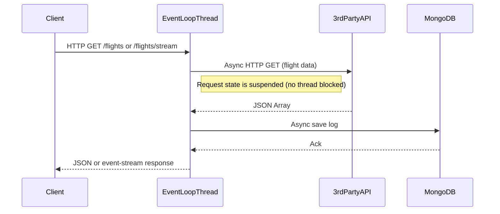

# Vert.x Application Module

## Overview

This module is a **production-ready Vert.x application** demonstrating the event-driven, non-blocking, highly concurrent programming model of Vert.x.

- `GET /flights`  
  Returns a JSON array of flights (fetched from a third-party API).
- `GET /flights/stream`  
  Streams the same flight data as Server-Sent Events (`text/event-stream`).
- Every API call and flight response is logged as a document in MongoDB (`calls_log` collection).

---

## Internal Execution Model

- **Event-loop Model:**  
  Vert.x uses a small, fixed number of event loop threads for all IO and request handling (default: 2 × CPU cores).
- **Non-blocking IO:**  
  HTTP, MongoDB, and third-party calls are fully asynchronous and non-blocking. No thread is blocked waiting on IO.
- **Worker Threads:**  
  Used only if blocking code is introduced (not needed in this example).

---

## Sequence Diagram



---

## How and When to Use

### When to Use

- **Massive concurrency on limited hardware:**  
  When your service must handle many thousands of concurrent slow clients (e.g., streaming, chat, API gateway, IoT, etc.).
- **Streaming and Event-driven APIs:**  
  When you need low-latency, backpressure-aware, or event-based communication (SSE, WebSockets, etc.).
- **Cloud Native and Polyglot:**  
  When you need a lightweight, native, or polyglot microservice.

### How to Use

- Build with Maven: `mvn clean package`
- Run with Docker:  
  ```
  docker build -t vertx-app .
  docker run -p 8080:8080 vertx-app
  ```
- Configure MongoDB in the application if needed.
- Access:
  - `GET http://localhost:8080/flights`
  - `GET http://localhost:8080/flights/stream`

---

## Limitations

### Technical

- **No traditional Spring Boot features:**  
  Vert.x is standalone—Spring DI, Spring Data, and Boot features are not available unless manually integrated.
- **Blocking code is dangerous:**  
  Any blocking call on the event loop thread (e.g., JDBC, legacy library) can kill concurrency and throughput.
- **Callback/Async paradigm:**  
  The codebase uses callbacks, futures, or coroutines (if using Kotlin), which may be less familiar for some Java teams.

### Community & Ecosystem

- **Mature but specialized:**  
  Large and growing Vert.x community, but fewer enterprise examples vs. Spring Boot.
- **Polyglot:**  
  Can use Java, Kotlin, Scala, Groovy, JavaScript, etc.

---

## Future Scope for Organizations

- **Scalability:**  
  Vert.x is ideal for microservices, gateways, and streaming APIs needing ultra-high concurrency.
- **Cloud Native Ready:**  
  Works well on Kubernetes, supports GraalVM native images for small, fast services.
- **Skill Growth:**  
  Teams should learn event-driven and non-blocking design for best results.

---

## Summary

Vert.x is a best-in-class toolkit for building high-throughput, non-blocking, and event-driven Java microservices.  
Use it when performance, concurrency, and resource efficiency are paramount—especially for streaming or real-time APIs.

---